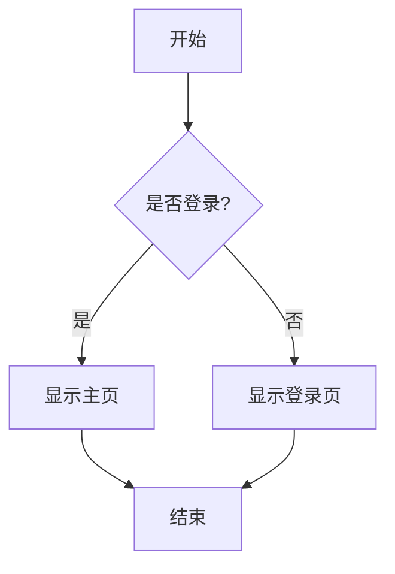
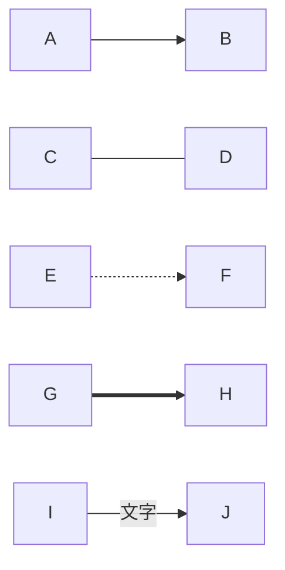
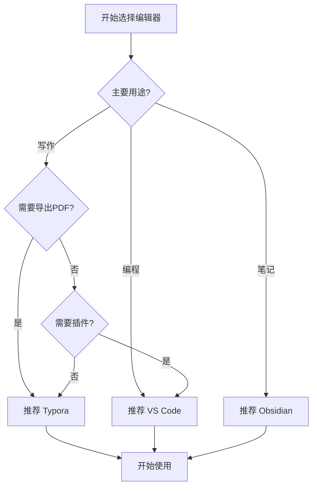
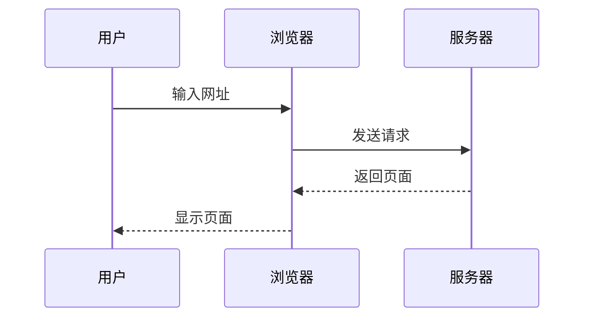
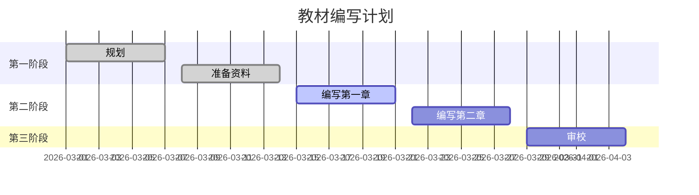
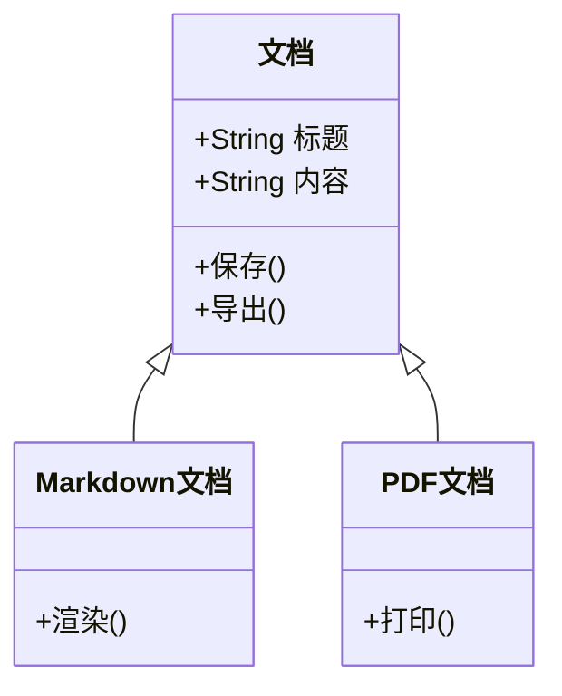

# 第四章：不只是基础语法——表格、任务列表、图表与扩展特性

> 语言 / Language：**中文** | [English](../../en/chapters/04-advanced-markdown-features.md)

## 本章你会学到什么

本章将学习 Markdown 的高级特性：如何制作复杂的表格让数据展示更清晰，如何使用任务列表管理待办事项，如何用 Mermaid 画流程图、时序图等图表，如何在 Markdown 中使用数学公式和化学公式，如何用 HTML 突破 Markdown 的限制，以及如何写出在不同平台都能正确显示的文档。

## 为什么需要这些高级特性

前面的章节中，我们学习了 Markdown 的基础语法：标题、段落、列表、链接、图片、代码块等。这些基础语法足够写出清晰的文档了。

但是，当开始写更专业的内容时，会发现基础语法有些力不从心。写技术文档时需要展示复杂的数据对比，基础表格不够用；项目规划需要画流程图、时序图来说明系统架构；学习笔记需要写数学公式、化学方程式；任务管理需要在文档中直接管理待办事项。

这就是为什么我们需要学习 Markdown 的高级特性——它们让文档更专业、更实用、更强大。

## 表格的进阶用法

### 复习：基础表格语法

在第三章我们学过基础表格语法：

```markdown
| 列1 | 列2 | 列3 |
|-----|-----|-----|
| 内容1 | 内容2 | 内容3 |
| 内容4 | 内容5 | 内容6 |
```

效果：

| 列1 | 列2 | 列3 |
|-----|-----|-----|
| 内容1 | 内容2 | 内容3 |
| 内容4 | 内容5 | 内容6 |

### 对齐方式

通过在分隔线中添加冒号来控制列的对齐方式：

```markdown
| 左对齐 | 居中对齐 | 右对齐 |
|:-------|:--------:|-------:|
| 内容1  | 内容2    | 内容3  |
| 内容4  | 内容5    | 内容6  |
```

效果：

| 左对齐 | 居中对齐 | 右对齐 |
|:-------|:--------:|-------:|
| 内容1  | 内容2    | 内容3  |
| 内容4  | 内容5    | 内容6  |

对齐规则：
- `:-----` 左对齐（默认）
- `:----:` 居中对齐
- `-----:` 右对齐

使用建议：
- 文字内容：左对齐
- 数字、价格：右对齐
- 标题、状态：居中对齐

### 在 Typora 中快速编辑表格

Typora 提供了方便的表格编辑功能：

1. 创建表格：
   - 输入 `| 列1 | 列2 |` 然后按回车
   - 或者用快捷键：`Ctrl/Cmd + T`

2. 编辑表格：
   - 点击单元格直接编辑
   - `Tab` 键：移动到下一个单元格
   - `Shift + Tab`：移动到上一个单元格
   - `Enter`：在当前行下方插入新行

3. 调整表格：
   - 右键点击表格 → 选择"表格"菜单
   - 可以插入/删除行列
   - 可以设置对齐方式

### 表格中使用格式

表格单元格中可以使用大部分 Markdown 格式：

```markdown
| 功能 | 语法 | 示例 |
|------|------|------|
| **粗体** | `**文字**` | 重要 |
| *斜体* | `*文字*` | *强调* |
| `代码` | `` `代码` `` | `git commit` |
| [链接](url) | `[文字](url)` | [GitHub](https://github.com) |
```

效果：

| 功能 | 语法 | 示例 |
|------|------|------|
| **粗体** | `**文字**` | 重要 |
| *斜体* | `*文字*` | *强调* |
| `代码` | `` `代码` `` | `git commit` |
| [链接](url) | `[文字](url)` | [GitHub](https://github.com) |

### 复杂表格的组织技巧

#### 技巧1：使用空格对齐源码

虽然 Markdown 不要求源码对齐，但对齐后更容易阅读和编辑：

```markdown
| 工具      | 类型       | 价格   |
|-----------|------------|--------|
| Typora    | 编辑器     | $14.99 |
| VS Code   | 编辑器     | 免费   |
| Obsidian  | 笔记软件   | 免费   |
```

#### 技巧2：使用表格生成器

对于复杂表格，可以使用在线工具生成：
- [Tables Generator](https://www.tablesgenerator.com/markdown_tables)
- 直接在 Excel 中编辑，然后转换成 Markdown

#### 技巧3：拆分大表格

如果表格太大，考虑拆分成多个小表格，每个表格专注一个主题。

### 实战：制作功能对比表

**场景**：写一篇文章，对比三个 Markdown 编辑器的功能。

```markdown
| 功能 | Typora | VS Code | Obsidian |
|:-----|:------:|:-------:|:--------:|
| 实时预览 | 支持 | 不支持 | 支持 |
| 语法高亮 | 支持 | 支持 | 支持 |
| 图片管理 | 支持 | 部分支持 | 支持 |
| 导出 PDF | 支持 | 部分支持 | 部分支持 |
| 价格 | $14.99 | 免费 | 免费 |
| 适合场景 | 写作 | 编程 | 笔记 |
```

效果：

| 功能 | Typora | VS Code | Obsidian |
|:-----|:------:|:-------:|:--------:|
| 实时预览 | 支持 | 不支持 | 支持 |
| 语法高亮 | 支持 | 支持 | 支持 |
| 图片管理 | 支持 | 部分支持 | 支持 |
| 导出 PDF | 支持 | 部分支持 | 部分支持 |
| 价格 | $14.99 | 免费 | 免费 |
| 适合场景 | 写作 | 编程 | 笔记 |


## 任务列表：管理待办事项

### 这是什么

任务列表（Task List）是 GitHub Flavored Markdown (GFM) 的扩展语法，用来创建可勾选的待办事项列表。

### 语法

```markdown
- [ ] 未完成的任务
- [x] 已完成的任务
- [ ] 另一个未完成的任务
```

效果：

- [ ] 未完成的任务
- [x] 已完成的任务
- [ ] 另一个未完成的任务

注意：
- `[ ]` 中间有一个空格，表示未完成
- `[x]` 或 `[X]` 表示已完成
- 必须在列表项（`-` 或 `*`）后面使用

### 在 Typora 中使用

Typora 对任务列表有特殊支持：

1. **创建任务列表**：
   - 输入 `- [ ]` 然后按空格
   - 会自动转换成可勾选的复选框

2. **切换状态**：
   - 直接点击复选框
   - 或者用快捷键：`Ctrl/Cmd + Enter`

3. **嵌套任务列表**：
   - 用 Tab 键缩进创建子任务

### 嵌套任务列表

可以创建多层级的任务列表：

```markdown
- [ ] 完成项目
  - [x] 需求分析
  - [x] 设计方案
  - [ ] 开发实现
    - [x] 前端开发
    - [ ] 后端开发
    - [ ] 测试
  - [ ] 部署上线
```

效果：

- [ ] 完成项目
  - [x] 需求分析
  - [x] 设计方案
  - [ ] 开发实现
    - [x] 前端开发
    - [ ] 后端开发
    - [ ] 测试
  - [ ] 部署上线

### 实战：用 Markdown 管理项目任务

**场景**：管理一个教材编写项目的任务。

```markdown
## 教材编写任务

### 第一阶段：规划
- [x] 确定教材主题
- [x] 制定章节大纲
- [x] 准备参考资料

### 第二阶段：编写
- [ ] 第一章：入门
  - [x] 中文版
  - [ ] 英文版
- [ ] 第二章：进阶
  - [ ] 中文版
  - [ ] 英文版

### 第三阶段：审校
- [ ] 技术审校
- [ ] 语言润色
- [ ] 格式统一
```

优点：
- 直观：一眼看出进度
- 灵活：随时添加、修改任务
- 版本控制：配合 Git 使用，可以追踪任务变化

## Mermaid 图表：用代码画图

### 这是什么

Mermaid 是一个用文本描述图表的工具。只需要写几行代码，就能生成流程图、时序图、甘特图等各种图表。

为什么用 Mermaid？
- 不需要专门的绘图软件
- 图表和文档在同一个文件中
- 易于版本控制（纯文本）
- 修改方便（改代码就行）

### 流程图（Flowchart）

流程图是最常用的图表类型，用来展示流程、决策、步骤等。

#### 基本语法

````markdown

````

效果：


#### 节点形状

Mermaid 支持多种节点形状：

````markdown

````

效果


#### 连接线类型

````markdown

````

效果


- `-->` 实线箭头
- `---` 实线
- `-.->` 虚线箭头
- `==>` 粗箭头
- `-- 文字 -->` 带文字的箭头

#### 方向

- `TD` 或 `TB`：从上到下（Top to Down/Bottom）
- `BT`：从下到上（Bottom to Top）
- `LR`：从左到右（Left to Right）
- `RL`：从右到左（Right to Left）

### 实战：画一个简单的工作流程

**场景**：画一个"如何选择 Markdown 编辑器"的流程图。

````markdown

````

效果


### 时序图（Sequence Diagram）

时序图用来展示对象之间的交互顺序，常用于描述系统架构、API 调用等。

#### 基本语法

````markdown

````

效果


### 甘特图（Gantt）

甘特图用来展示项目时间线和任务安排。

````markdown

````

效果


### 类图（Class Diagram）

类图用来展示面向对象设计中的类和它们之间的关系。

````markdown

````

效果


### 在 Typora 中使用 Mermaid

Typora 原生支持 Mermaid：

1. 输入 ` ```mermaid ` 创建代码块
2. 在代码块中输入 Mermaid 代码
3. Typora 会自动渲染成图表
4. 点击图表可以编辑代码

提示：如果图表没有显示，检查：
- 代码块语言是否设置为 `mermaid`
- Mermaid 语法是否正确
- Typora 版本是否支持（建议使用最新版本）

## 数学公式进阶

### 复习：基础公式语法

在第三章我们学过基础公式语法：

- **行内公式**：`$公式$`
- **块级公式**：`$$公式$$`

### 常用数学符号

#### 希腊字母

| 符号 | 代码 | 符号 | 代码 |
|------|------|------|------|
| α | `\alpha` | β | `\beta` |
| γ | `\gamma` | δ | `\delta` |
| θ | `\theta` | λ | `\lambda` |
| π | `\pi` | σ | `\sigma` |
| Σ | `\Sigma` | Δ | `\Delta` |

示例：

```markdown
圆的面积公式：$A = \pi r^2$
```

效果：圆的面积公式：$A = \pi r^2$

#### 上标和下标

```markdown
- 上标：$x^2$, $x^{10}$
- 下标：$x_1$, $x_{ij}$
- 组合：$x_1^2$, $\sum_{i=1}^{n}$
```

效果：
- 上标：$x^2$, $x^{10}$
- 下标：$x_1$, $x_{ij}$
- 组合：$x_1^2$, $\sum_{i=1}^{n}$

#### 分数

```markdown
- 行内分数：$\frac{1}{2}$
- 块级分数：$$\frac{a+b}{c+d}$$
```

效果：
- 行内分数：$\frac{1}{2}$
- 块级分数：

$$\frac{a+b}{c+d}$$

#### 根号

```markdown
- 平方根：$\sqrt{2}$
- n次方根：$\sqrt[n]{x}$
```

效果：
- 平方根：$\sqrt{2}$
- n次方根：$\sqrt[n]{x}$

#### 求和、积分

```markdown
- 求和：$\sum_{i=1}^{n} x_i$
- 积分：$\int_{a}^{b} f(x) dx$
- 极限：$\lim_{x \to \infty} f(x)$
```

效果：
- 求和：$\sum_{i=1}^{n} x_i$
- 积分：$\int_{a}^{b} f(x) dx$
- 极限：$\lim_{x \to \infty} f(x)$

### 矩阵和方程组

#### 矩阵

```latex
$$
\begin{matrix}
a & b \\
c & d
\end{matrix}
$$
```

效果
$$
\begin{matrix}
a & b \\
c & d
\end{matrix}
$$
带括号的矩阵：

```latex
$$
\begin{pmatrix}
a & b \\
c & d
\end{pmatrix}
$$
```

效果

$$
\begin{pmatrix}
a & b \\
c & d
\end{pmatrix}
$$

#### 方程组

```latex
$$
\begin{cases}
x + y = 5 \\
2x - y = 1
\end{cases}
$$
```

效果

$$
\begin{cases}
x + y = 5 \\
2x - y = 1
\end{cases}
$$

### 化学公式（mhchem 扩展）

Typora 支持 mhchem 扩展，可以写化学方程式：

```latex
$$\ce{H2O}$$
$$\ce{CO2 + H2O -> H2CO3}$$
$$\ce{2H2 + O2 -> 2H2O}$$
```

效果：
- 水：$\ce{H2O}$
- 光合作用：$\ce{CO2 + H2O -> H2CO3}$
- 燃烧：$\ce{2H2 + O2 -> 2H2O}$

### 实战：写一个包含公式的技术文档

**场景**：写一篇关于"二次方程求根公式"的文档。

```markdown
## 二次方程求根公式

对于一般的二次方程：

$$ax^2 + bx + c = 0 \quad (a \neq 0)$$

它的解为：

$$x = \frac{-b \pm \sqrt{b^2 - 4ac}}{2a}$$

其中：
- $a, b, c$ 是方程的系数
- $\Delta = b^2 - 4ac$ 称为判别式

根据判别式的值，可以判断方程根的情况：
- 当 $\Delta > 0$ 时，方程有两个不相等的实根
- 当 $\Delta = 0$ 时，方程有两个相等的实根
- 当 $\Delta < 0$ 时，方程没有实根
```

## HTML 嵌入：突破 Markdown 限制

### 什么时候需要 HTML

Markdown 的设计哲学是"简单够用"，但有时候需要一些 Markdown 不支持的功能：

- 折叠内容（details 标签）
- 键盘按键样式（kbd 标签）
- 高亮文本（mark 标签）
- 嵌入视频、音频
- 更复杂的布局

这时候，可以直接在 Markdown 中使用 HTML。

### 常用 HTML 标签

#### `<details>` 和 `<summary>`：折叠内容

```html
<details>
<summary>点击展开详细内容</summary>

这里是折叠的内容，只有点击"展开"后才会显示。

可以包含任何 Markdown 内容：
- 列表
- **粗体**
- `代码`

</details>
```

效果：

<details>
<summary>点击展开详细内容</summary>

这里是折叠的内容，只有点击"展开"后才会显示。

可以包含任何 Markdown 内容：
- 列表
- **粗体**
- `代码`

</details>

使用场景：
- FAQ（常见问题）
- 长篇补充说明
- 可选阅读内容

#### `<kbd>`：键盘按键

```html
按 <kbd>Ctrl</kbd> + <kbd>C</kbd> 复制
按 <kbd>Ctrl</kbd> + <kbd>V</kbd> 粘贴
```

效果：

按 <kbd>Ctrl</kbd> + <kbd>C</kbd> 复制
按 <kbd>Ctrl</kbd> + <kbd>V</kbd> 粘贴

#### `<mark>`：高亮文本

```html
这是一段普通文本，<mark>这部分被高亮了</mark>。
```

效果：

这是一段普通文本，<mark>这部分被高亮了</mark>。

#### 嵌入视频

```html
<video width="640" height="360" controls>
  <source src="video.mp4" type="video/mp4">
  您的浏览器不支持视频标签。
</video>
```

#### 嵌入音频

```html
<audio controls>
  <source src="audio.mp3" type="audio/mpeg">
  您的浏览器不支持音频标签。
</audio>
```

### 注意事项：兼容性问题

重要：不是所有平台都支持所有 HTML 标签。

- **Typora**：支持大部分 HTML 标签
- **GitHub**：支持部分 HTML 标签（出于安全考虑）
  - 支持：`<details>`, `<summary>`, `<kbd>`, `<sub>`, `<sup>`
  - 不支持：`<script>`, `<style>`, `<iframe>` 等
- **其他平台**：支持程度不一

建议：
- 如果文档要在多个平台展示，尽量少用 HTML
- 使用前先测试目标平台是否支持
- 为不支持的平台提供替代方案

## 平台兼容性提醒

### GitHub 支持什么、不支持什么

GitHub 使用 GitHub Flavored Markdown (GFM)，它支持：

支持的特性：
- 基础 Markdown 语法
- 表格
- 任务列表
- 删除线（`~~文字~~`）
- 自动链接（直接写 URL 会自动转成链接）
- Emoji（`:smile:` 等表情符号）
- 部分 HTML 标签

不支持或有限支持的特性：
- Mermaid 图表（GitHub 最近开始支持，但渲染可能不同）
- 数学公式（需要用图片或其他方式）
- 大部分 HTML 标签（出于安全考虑）
- 自定义 CSS

### Typora vs GitHub 的差异

| 特性 | Typora | GitHub |
|------|--------|--------|
| 基础语法 | 支持 | 支持 |
| 表格 | 支持 | 支持 |
| 任务列表 | 支持 | 支持 |
| Mermaid | 支持 | 部分支持 |
| 数学公式 | 支持 | 不支持 |
| HTML | 支持 | 部分支持 |
| 自定义主题 | 支持 | 不支持 |

### 如何写出兼容性好的文档

#### 原则1：优先使用标准 Markdown 语法

标准 Markdown 语法在所有平台都能正确显示。

#### 原则2：测试目标平台

如果你的文档要在 GitHub 上展示，写完后先在 GitHub 上预览一下。

#### 原则3：提供替代方案

如果使用了某些平台不支持的特性，提供替代方案：

```markdown
<!-- Mermaid 流程图（GitHub 可能不支持） -->


<!-- 如果上面的图表不显示，请查看：[流程图图片](flowchart.png) -->
```

#### 原则4：使用图片作为后备

对于复杂的图表、公式，可以导出成图片：

```markdown
<!-- 数学公式 -->
$$E = mc^2$$

<!-- 如果公式不显示，请查看： -->
```

## 常见问题与解决

### 问题1：Mermaid 图表在 GitHub 上不显示

**解决**：
1. 确认 GitHub 是否支持 Mermaid（最近开始支持）
2. 如果不支持，导出成图片：
   - 在 Typora 中右键点击图表 → 导出为图片
   - 用图片替代 Mermaid 代码

### 问题2：数学公式在 GitHub 上不显示

**解决**：
1. 使用图片：将公式导出成图片
2. 使用在线公式渲染服务（如 CodeCogs）
3. 使用 GitHub 的 LaTeX 渲染（在 issue 和 PR 中支持）

### 问题3：表格在 Typora 和 GitHub 上显示不一致

**解决**：
- 检查对齐语法是否正确
- 避免在表格中使用过于复杂的格式
- 在 GitHub 上预览确认

### 问题4：任务列表无法勾选

**解决**：
- 在 Typora 中：直接点击复选框
- 在 GitHub 中：需要编辑文件才能修改
- 在其他编辑器中：手动修改 `[ ]` 为 `[x]`

## 本章小结

在这一章，我们学习了 Markdown 的高级特性。

表格进阶部分，我们学习了对齐方式（左对齐、居中、右对齐），如何在 Typora 中快速编辑表格，如何在表格中使用格式，以及复杂表格的组织技巧。

任务列表部分，我们学习了语法 `- [ ]` 和 `- [x]`，如何在 Typora 中点击切换状态，如何创建嵌套任务列表，以及如何用 Markdown 管理项目任务。

Mermaid 图表部分，我们学习了流程图（展示流程和决策）、时序图（展示对象交互）、甘特图（展示项目时间线）和类图（展示面向对象设计）。

数学公式进阶部分，我们学习了常用数学符号、矩阵和方程组，以及化学公式（mhchem）。

HTML 嵌入部分，我们学习了 `<details>` 和 `<summary>`（折叠内容）、`<kbd>`（键盘按键）、`<mark>`（高亮文本），以及如何嵌入视频和音频。

平台兼容性部分，我们学习了 GitHub 支持和不支持的特性、Typora vs GitHub 的差异，以及如何写出兼容性好的文档。

## 下一步

现在已经掌握了 Markdown 的高级特性，可以写出更专业、更强大的文档了。

但是，写完文档后，还需要：
- 导出成 PDF 或 HTML
- 发布到网站
- 确保在不同平台正确显示

在下一章，我们会学习**导出、发布与平台兼容性**：
- 如何用 Typora 导出专业的 PDF
- 如何使用 YAML Front Matter 管理文档元数据
- 如何优化 GitHub 展示效果
- 如何发布到 GitHub Pages
