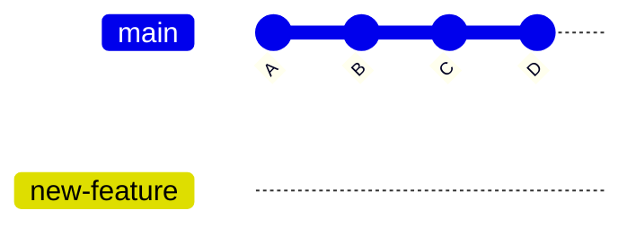
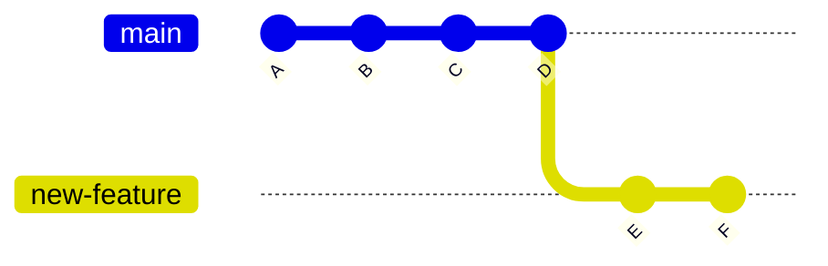
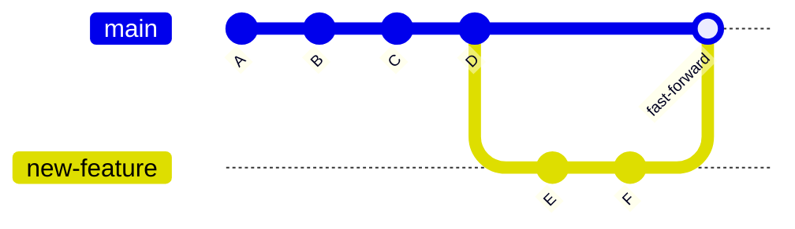
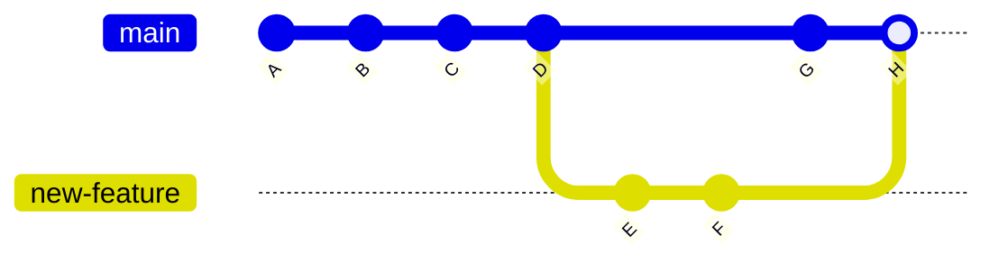

# Chapter 4: Branches — Working on Multiple Things at Once

## What You'll Learn in This Chapter

- Understand what branches are and why they matter
- Create, switch, rename, and delete branches
- Merge branches together and resolve merge conflicts
- Use `git stash` to temporarily save unfinished work

## When One Line Isn't Enough

Imagine you're writing a document. You've been making steady progress on Chapter 4, but then your editor messages you: "We need to fix a typo in Chapter 1 right away — the PDF goes to print tomorrow."

Without branches, you have a problem. Your working directory has all your Chapter 4 changes. You could commit what you have, then fix the typo, then go back to Chapter 4. But that mixes two unrelated changes into the same timeline. If the typo fix introduces a problem, you can't easily undo it without also undoing your Chapter 4 work.

With branches, the solution is clean: create a new branch, fix the typo there, commit it, merge it back. Your Chapter 4 work never gets disturbed.

This is the core idea of branching — it lets Git maintain multiple independent lines of development at the same time. Each branch is a separate workspace. Changes on one branch don't affect the others, until you decide to bring them together.

## What Exactly Is a Branch?

In Git, a branch is just a movable pointer that points to a commit. That's it. It's not a copy of your files, not a folder, not anything heavy. It's a lightweight label — 41 bytes of data — that tells Git "the latest commit on this line of development is here."

When you create a new repository and make your first commit, Git automatically creates a branch called `main` (or `master` in older setups). This pointer moves forward every time you make a new commit.



Both branches point to the same commit right now. But as you make new commits on `new-feature`, the two pointers diverge:



`main` still points to D, while `new-feature` has moved on to F. The commits A through D are shared — they exist in both histories. Only E and F are unique to `new-feature`.

This is why creating a branch in Git is essentially instantaneous and costs almost nothing. You're not copying files. You're just adding a label.

## Creating and Switching Branches

### Creating a branch

```bash
$ git branch new-feature
```

This creates a new branch called `new-feature` based on your current commit. Your working directory doesn't change — you're still on the same branch as before. To confirm which branch you're on:

```bash
$ git branch
* main
  new-feature
```

The `*` marks the current branch. `new-feature` exists, but you haven't switched to it yet.

### Switching to a branch

```bash
$ git checkout new-feature
```

Or the newer, recommended command:

```bash
$ git switch new-feature
```

Now your working directory reflects the state of `new-feature`. Any changes you make and commit will advance this branch, not `main`.

```bash
$ git branch
  main
* new-feature
```

The `*` has moved. You're now on `new-feature`.

### Creating and switching in one step

Most of the time, you want to create a branch and switch to it immediately:

```bash
$ git checkout -b new-feature
```

Or:

```bash
$ git switch -c new-feature
```

Both commands do the same thing: create the branch and switch to it in one step. This is the most common workflow — you think of a new task, create a branch for it, and start working.

### A complete example

Here's what a typical branch workflow looks like from start to finish:

```bash
# 1. Check current status
$ git status
On branch main
nothing to commit, working tree clean

# 2. Create and switch to a new branch
$ git switch -c fix-typo-in-ch1

# 3. Make your changes
# (edit chapter-01.md)

# 4. Commit
$ git add chapter-01.md
$ git commit -m "fix: correct typo in chapter 1 heading"

# 5. Switch back to main
$ git switch main

# 6. Your Chapter 4 changes are still here
# (they were never touched)
```

### Renaming a branch

If you gave a branch a name that no longer fits:

```bash
# Rename the current branch
$ git branch -m better-name

# Rename a different branch
$ git branch -m old-name better-name
```

### Deleting a branch

After you've merged a branch and no longer need it, delete it to keep things tidy:

```bash
$ git branch -d fix-typo-in-ch1
```

Git will refuse to delete if the branch hasn't been merged yet (to protect you from losing work). If you're sure you want to delete anyway:

```bash
$ git branch -D fix-typo-in-ch1
```

The uppercase `-D` forces deletion. Use it only when you're certain the branch's work is no longer needed.

## Viewing Branches

You've already seen `git branch` to list local branches. Here are the useful variations:

```bash
# List all branches (local and remote)
$ git branch -a

# List branches with their last commit message
$ git branch -v

# List branches that have been merged into the current branch
$ git branch --merged

# List branches that have NOT been merged
$ git branch --no-merged
```

`--merged` is particularly useful for cleanup: it shows you which branches are safe to delete because their work has already been incorporated.

## Merging Branches

So you've been working on `new-feature`, made several commits, and now you're happy with the result. Time to bring those changes into `main`.

### Basic merge

```bash
# 1. Switch to the branch you want to merge INTO
$ git switch main

# 2. Merge the other branch INTO this one
$ git merge new-feature
```

Git performs a **fast-forward merge** when the branch being merged (here, `new-feature`) is simply ahead of the target branch (`main`). In this case, Git just moves the `main` pointer forward:



The history is a straight line. No special commit is created — `main` simply catches up to where `new-feature` was.

### When fast-forward doesn't apply

If `main` has received new commits since you branched off, a fast-forward is no longer possible. Git must create a **merge commit** to combine the two lines of history:



Git will open your editor and ask you to write a merge commit message. The default message is usually fine:

```
Merge branch 'new-feature'
```

You can add more context if you want, or just save and close the editor.

### Merge conflicts

A merge conflict happens when the same part of the same file was modified differently on both branches. Git can't automatically decide which version to keep, so it stops and asks you to resolve it.

Suppose both branches edited line 10 of `chapter-04.md`:

```bash
$ git merge new-feature
Auto-merging chapter-04.md
CONFLICT (content): Merge conflict in chapter-04.md
Automatic merge failed; fix conflicts and then commit the result.
```

Git marks the conflicted sections in the file:

```markdown
# Chapter 4

<<<<<<< new-feature
This is the version from new-feature branch.
=======
This is the version from main branch.
>>>>>>> main
```

The markers are straightforward:

- `<<<<<<< new-feature` — start of the conflict, this section is from `new-feature`
- `=======` — separator between the two versions
- `>>>>>>> main` — end of the conflict, this section is from `main`

To resolve the conflict, edit the file: choose one version, combine them, or write something new. Then remove all the conflict markers:

```markdown
# Chapter 4

This is the resolved version that combines the best of both.
```

After resolving, stage and commit:

```bash
# 1. Mark the conflict as resolved
$ git add chapter-04.md

# 2. Complete the merge
$ git commit
```

Git already knows this is a merge commit, so it will use a default merge message. You can edit it if needed.

### Aborting a merge

If you started a merge but realize it's too messy or you're not ready:

```bash
$ git merge --abort
```

This cancels the merge and returns you to the state before you ran `git merge`. Your working directory and staging area are restored.

## Git Stash: Save Work Without Committing

Sometimes you're in the middle of something on one branch, and you need to switch to another branch to fix something urgent. But your current changes aren't ready to commit — they're half-finished.

`git stash` lets you save your uncommitted changes temporarily, switch branches, do your work, and come back to pick up where you left off.

### Saving your work

```bash
# Save current changes
$ git stash
Saved working directory and index state WIP on main: 61b6377 docs: add chapter 3
```

Your working directory is now clean — you can switch branches freely.

### Stashing with a message

If you have multiple stashes, add a message so you can identify them later:

```bash
$ git stash push -m "half-finished chapter 4 draft"
```

### Viewing stashes

```bash
$ git stash list
stash@{0}: On main: half-finished chapter 4 draft
stash@{1}: On main: WIP saved before switching to fix typo
```

### Restoring your work

```bash
# Apply the most recent stash (keep it in the stash list)
$ git stash apply

# Apply a specific stash
$ git stash apply stash@{1}

# Apply and remove the stash from the list
$ git stash pop
```

`apply` keeps the stash so you can use it again. `pop` applies it and removes it from the list. Most of the time, `pop` is what you want — once you've restored the work, you don't need the stash anymore.

### Stashing is branch-aware

One important detail: `git stash` saves the actual file changes, not a branch-specific snapshot. You can apply a stash on a different branch from where you created it. This is useful if you started work on the wrong branch — just stash, switch, pop.

## Practical Workflow: Feature Branch

Here's a realistic example that ties branching, merging, and stashing together. Suppose you're maintaining a textbook project:

```bash
# 1. Start from main, make sure it's up to date
$ git switch main
$ git pull

# 2. Create a branch for the new chapter
$ git switch -c write-chapter-5

# 3. Write for a while, make some commits
# (edit, add, commit, repeat...)

# 4. Oops, urgent typo fix needed on main
$ git stash                      # save half-finished work
$ git switch main                # switch to main
$ git switch -c fix-urgent-typo  # create branch for the fix

# (edit typo, add, commit)

# 5. Merge the fix into main
$ git switch main
$ git merge fix-urgent-typo

# 6. Go back to your chapter work
$ git switch write-chapter-5
$ git stash pop                 # restore your half-finished work

# 7. Continue writing, finish the chapter
# (edit, add, commit...)

# 8. Merge the chapter into main
$ git switch main
$ git merge write-chapter-5

# 9. Clean up merged branches
$ git branch -d fix-urgent-typo
$ git branch -d write-chapter-5
```

This workflow has several advantages:

- The typo fix and the new chapter are completely isolated from each other
- Each change has its own clear commit history
- If something goes wrong with one task, it doesn't affect the other
- The main branch stays stable — new work only enters it through explicit merges

## Branch Naming Conventions

Good branch names help you and your collaborators understand what each branch is for at a glance. Here are some common patterns:

- `fix/description` — bug fixes, e.g. `fix/typo-in-ch1`, `fix/wrong-formula`
- `feature/description` — new features or content, e.g. `feature/chapter-5`, `feature/add-exercises`
- `docs/description` — documentation changes, e.g. `docs/update-readme`
- `experiment/description` — risky or exploratory work, e.g. `experiment/new-layout`

The pattern is: `type/short-description`. Keep it lowercase, use hyphens instead of spaces, and make the description specific enough that you'll still understand it a week from now.

## Common Problems and Solutions

**Problem 1: I created changes on `main` but meant to do them on a new branch.**

Create a new branch from your current state — Git will carry your uncommitted changes over:

```bash
$ git switch -c new-feature
```

Or if you already committed:

```bash
$ git branch new-feature       # create branch at current commit
$ git reset --mixed HEAD~1     # undo the commit on main (keeps changes)
```

**Problem 2: I'm on the wrong branch and already committed.**

Move the commit to the correct branch:

```bash
# Create the correct branch first
$ git branch correct-branch
# Move main back one commit
$ git switch main
$ git reset --mixed HEAD~1
# Switch to correct branch — your commit is there
$ git switch correct-branch
```

**Problem 3: Merge conflict looks overwhelming.**

Don't panic. Use `git diff` to see exactly what's different:

```bash
$ git diff
```

Focus on the conflict markers one section at a time. If it's truly too complex, abort the merge and try again when you're better prepared:

```bash
$ git merge --abort
```

**Problem 4: I accidentally deleted a branch.**

Recover it using `git reflog`:

```bash
# Find the commit the branch pointed to
$ git reflog
# Look for the commit where you were working on that branch
# Then recreate the branch
$ git branch recovered-branch <commit-ID>
```

**Problem 5: `git stash pop` causes conflicts.**

This happens when the stash's changes conflict with the current state of your branch. Resolve the conflicts just like a merge conflict, then commit:

```bash
$ git add <conflicted-files>
$ git commit
```

## Chapter summary

Branches are one of Git's most powerful features. A branch is just a lightweight pointer to a commit — creating one is nearly free, and switching between branches is instantaneous.

The core branch workflow is: create a branch for a task, make commits on it, then merge it back into `main`. `git switch -c branch-name` creates and switches, `git switch main` goes back, `git merge branch-name` brings the work together.

When both branches modify the same part of the same file, a merge conflict occurs. Git marks the conflicting sections with `<<<<<<<`, `=======`, and `>>>>>>>`. You resolve conflicts by editing the file to choose or combine the versions, then staging and committing the result.

`git stash` lets you save uncommitted work temporarily, switch branches, do other work, and come back. `git stash push -m "message"` saves with a label, `git stash pop` restores and removes the stash.

Good branch names follow the `type/description` pattern and make it easy to understand what each branch is for.

## Next steps

You now know how to use branches to manage multiple lines of work in a single repository. But so far, everything has been on your local machine. The next chapter will connect your local work to the wider world: remote repositories. You'll learn about `git remote`, `git fetch`, `git pull`, `git push`, and how local branches relate to remote tracking branches. This is the foundation for everything that comes after — collaboration, code review, and GitHub workflows.
