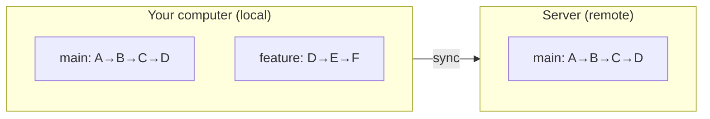
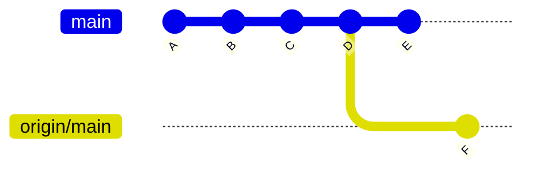

# Chapter 5: Remote Repositories — Connecting Your Work to the World

## What You'll Learn in This Chapter

- Understand what a remote repository is and how it relates to your local repository
- Add, view, and remove remote connections with `git remote`
- Download remote changes with `git fetch` and `git pull`
- Upload local changes with `git push`
- Understand the relationship between local branches and remote-tracking branches

## Your Work Has Been on an Island

Everything you've done so far — commits, branches, merges, stashes — has lived entirely on your own computer. Your repository is local. If your hard drive dies, all that history is gone. If you want to collaborate with someone else, there's no way to share your work. If you switch between your laptop and your desktop, the changes you made on one machine don't exist on the other.

A remote repository solves all of these problems. It's a copy of your repository that lives on a server — most commonly GitHub, GitLab, or Bitbucket. Your local repository and the remote repository can exchange changes. You upload your commits, download others' commits, and keep both copies in sync.

The relationship is straightforward: you have a local repo, the server has a copy. They talk to each other through a few specific commands. That's the whole picture.

## Local and Remote: The Mental Model

Think of your local repository and the remote repository as two separate copies of the same project. Each has its own branches, its own commit history. They can diverge — you might have commits locally that the remote doesn't have, and the remote might have commits you don't have.

The key insight is that neither copy is "the real one." They're equal. Git doesn't treat the remote as more authoritative than your local repo. The remote is just another copy that happens to live on a server.

Here's the basic flow:



Right now, the local `main` and remote `main` are at the same point (D). But you have a local `feature` branch with commits E and F that the remote doesn't know about. You can push that branch to the remote to share it. If someone else adds commits on the remote, you can pull them to get those changes locally.

This is the fundamental model. Everything else in this chapter is details about how to set up and manage this relationship.

## Setting Up a Remote: `git remote`

### Adding a remote

When you clone a repository from GitHub, the remote is configured automatically. But if you created a local repository first and now want to connect it to a remote, you add one manually:

```bash
$ git remote add origin https://github.com/yourname/your-repo.git
```

Let's break this down:

- `git remote add` — the command to register a new remote
- `origin` — a short name for this remote (a nickname, essentially)
- the URL — where the remote repository lives

The name `origin` is a convention, not a requirement. By convention, `origin` refers to the primary remote — the one you cloned from or the one you consider "home base." You can name it anything you want, but `origin` is so widely used that deviating from it will confuse your collaborators and your future self.

Remote URLs come in two forms:

- **HTTPS**: `https://github.com/yourname/your-repo.git` — works everywhere, authenticates with a personal access token or password
- **SSH**: `git@github.com:yourname/your-repo.git` — uses SSH keys for authentication, no password needed once set up

Both work. HTTPS is simpler to start with. SSH is more convenient once you've set up your keys.

### Viewing remotes

```bash
# List all remotes
$ git remote
origin

# Show remote URLs
$ git remote -v
origin  https://github.com/yourname/your-repo.git (fetch)
origin  https://github.com/yourname/your-repo.git (push)
```

Each remote has two URLs: one for fetching (downloading) and one for pushing (uploading). Usually they're the same, but they can be different in advanced setups.

### Renaming and removing remotes

```bash
# Rename a remote
$ git remote rename origin upstream

# Remove a remote
$ git remote remove origin
```

Renaming is useful if you forked a repository and want to keep the original as `upstream` and your fork as `origin`. Removing is useful if you're cleaning up old connections.

## Cloning: The Other Way to Get a Remote

If the remote repository already exists, you can clone it instead of creating a local repo and adding a remote manually:

```bash
$ git clone https://github.com/yourname/your-repo.git
```

This does several things at once:

- Creates a new directory with the repository name
- Initializes a local Git repository inside it
- Adds the remote as `origin`
- Downloads all the history
- Checks out the default branch (usually `main`)

After cloning, you're ready to work. The remote is already configured, and your local history matches the remote.

You can clone into a directory with a custom name:

```bash
$ git clone https://github.com/yourname/your-repo.git my-custom-name
```

Or clone a specific branch:

```bash
$ git clone --branch develop https://github.com/yourname/your-repo.git
```

## Downloading Changes: `git fetch` and `git pull`

### `git fetch`: Download without merging

`git fetch` downloads new commits and branches from the remote, but does not change your local branches. It's the safest way to see what's new on the remote.

```bash
$ git fetch origin
```

This downloads everything from `origin` that you don't have yet — new commits, new branches, new tags — and stores them locally in what Git calls "remote-tracking branches." We'll explain those shortly.

After fetching, you can inspect what changed:

```bash
# See what new commits arrived
$ git log HEAD..origin/main --oneline

# See what changed in the files
$ git diff HEAD..origin/main
```

These commands compare your current `main` with the remote's `main` without touching your working directory.

`git fetch` is the "look before you leap" command. It lets you review remote changes before deciding whether to merge them into your work.

### `git pull`: Download and merge in one step

`git pull` is essentially `git fetch` followed by `git merge`. It downloads the changes and immediately merges them into your current branch.

```bash
$ git pull origin main
```

This is equivalent to:

```bash
$ git fetch origin
$ git merge origin/main
```

`git pull` is convenient when you know you want to merge right away — for example, when you're on `main` and just want to update to the latest version. But it's less safe than `fetch` because it changes your local state immediately. If there are conflicts, you have to deal with them right now.

### Fetch vs Pull: When to Use Which

| Situation | Use |
|-----------|-----|
| You want to review changes before merging | `git fetch` |
| You're collaborating and want to see what others have done | `git fetch` |
| You're on `main` and just want to catch up | `git pull` |
| You're sure there won't be conflicts | `git pull` |
| You want maximum control over what enters your branch | `git fetch` |

A good habit is to default to `git fetch`, review the changes, and then decide whether to merge. This gives you time to understand what you're bringing in before it affects your work.

## Uploading Changes: `git push`

### Basic push

After you've made commits locally, you send them to the remote with `git push`:

```bash
$ git push origin main
```

This uploads your local `main` branch's commits to the remote's `main` branch. After the push, both copies are in sync.

### The first push to a new branch

When you create a new local branch and want to push it for the first time, you need to tell Git that this local branch should track a remote branch:

```bash
$ git push -u origin new-feature
```

The `-u` (or `--set-upstream`) flag does two things: it pushes the branch to the remote, and it sets up tracking so that future pushes and pulls on this branch know which remote branch to use. After the first push with `-u`, you can just run:

```bash
$ git push
```

No need to specify the remote and branch name again — Git remembers the tracking relationship.

### What happens if the remote has new commits

If someone else pushed changes to the remote while you were working locally, your push will be rejected:

```bash
$ git push origin main
To https://github.com/yourname/your-repo.git
 ! [rejected]        main -> main (fetch first)
error: failed to push some refs to 'github.com:yourname/your-repo.git'
hint: Updates were rejected because the remote contains work that you do
hint: not have locally. This is usually caused by another repository pushing
hint: to the same ref.
```

This is Git protecting you. If you force your push, you'd overwrite someone else's work. Instead, pull first to integrate their changes, resolve any conflicts, then push again:

```bash
$ git pull origin main
# resolve conflicts if any
$ git push origin main
```

### Force pushing: Use with extreme caution

You can force a push to overwrite the remote history:

```bash
$ git push --force origin main
```

This replaces the remote's history with your local history. Any commits on the remote that you don't have locally are permanently lost for other collaborators.

**Warning**: Never force push to a shared branch like `main`. This is only acceptable on your own personal branch where nobody else is working. If multiple people use the branch, force pushing will break their repositories.

A slightly safer alternative is `--force-with-lease`:

```bash
$ git push --force-with-lease origin main
```

This checks that the remote hasn't been updated since your last fetch. If it has, the push is rejected. This prevents you from accidentally overwriting someone else's work, while still allowing you to rewrite history when you're sure it's safe.

## Remote-Tracking Branches

After you run `git fetch` or `git clone`, Git creates special branches called remote-tracking branches. These are how Git keeps track of what the remote looks like locally.

Remote-tracking branches live in your repository but you can't edit them directly. They're read-only mirrors of the remote's state. They follow a naming convention:

```
<remote-name>/<branch-name>
```

For example, after fetching from `origin`, you'll see:

```bash
$ git branch -a
* main
  new-feature
  remotes/origin/main
  remotes/origin/new-feature
  remotes/origin/develop
```

The branches under `remotes/origin/` are remote-tracking branches. They reflect the state of `origin` the last time you fetched. They update when you run `git fetch` — they don't update automatically.

When you run `git merge origin/main`, you're merging the remote-tracking branch `origin/main` into your local `main`. When you run `git push origin main`, you're sending your local `main` to update the remote's `main` (and consequently, `origin/main` will be updated next time you fetch).

This distinction matters. `origin/main` is not the same as `main`. `origin/main` is your local copy's record of what the remote looks like. `main` is your local branch where you actually work. They can point to different commits, and they often do — that's exactly the situation when the remote has new commits you haven't pulled yet.



Here, you have commit E that the remote doesn't have, and the remote has commit F that you don't have. Running `git pull` will merge F into your `main`, creating a merge commit G.

## The Complete Sync Workflow

Here's a complete workflow that ties together fetch, pull, push, and remote-tracking branches:

```bash
# 1. Start by fetching to see what's new
$ git fetch origin

# 2. Check what changed on the remote
$ git log HEAD..origin/main --oneline

# 3. If you want to integrate the changes
$ git pull origin main
# (resolve conflicts if needed)

# 4. Do your work
# (edit files, add, commit...)

# 5. Push your changes
$ git push origin main
```

For day-to-day work on a personal project, `git pull` followed by your work followed by `git push` is the standard rhythm. For team collaboration, getting into the habit of `git fetch` first — so you can see what's coming before it arrives — is a worthwhile discipline.

## Common Problems and Solutions

**Problem 1: "fatal: 'origin' does not appear to be a git repository"**

You're trying to push or pull, but no remote has been configured. Add one:

```bash
$ git remote add origin https://github.com/yourname/your-repo.git
```

**Problem 2: Push rejected because remote has new commits.**

Pull first, then push:

```bash
$ git pull origin main
$ git push origin main
```

If the pull causes conflicts, resolve them (edit the conflicted files, `git add`, `git commit`), then push.

**Problem 3: I accidentally committed to `main` instead of a new branch.**

Move the commit to a new branch and reset `main`:

```bash
$ git branch new-feature          # create branch at current commit
$ git reset --hard HEAD~1         # move main back
$ git switch new-feature          # switch to the branch with your commit
```

Then push the new branch:

```bash
$ git push -u origin new-feature
```

**Problem 4: I want to undo a push.**

If the push was recent and nobody else has built on it:

```bash
$ git reset --hard HEAD~1
$ git push --force-with-lease origin main
```

If others have already pulled your changes, don't force push. Use `git revert` instead:

```bash
$ git revert <commit-ID>
$ git push origin main
```

**Problem 5: "error: failed to push some refs" after someone else pushed to the same branch.**

This is normal. It means the remote has moved forward since your last fetch. Pull first to integrate their changes, then push yours:

```bash
$ git pull --rebase origin main
$ git push origin main
```

`--rebase` replays your commits on top of the remote's commits, which often produces a cleaner history than a merge commit. We'll cover rebase in detail in a later chapter.

## Chapter summary

Remote repositories are copies of your repository that live on a server, enabling backup, sharing, and collaboration. The most common hosts are GitHub, GitLab, and Bitbucket.

`git remote add origin <url>` connects your local repo to a remote. `git clone <url>` creates a local copy of an existing remote repo, complete with history and remote configuration.

`git fetch` downloads remote changes without modifying your local branches — it's the safe option for reviewing what's new. `git pull` downloads and merges in one step — it's convenient when you just want to catch up. Default to `fetch` when collaborating, use `pull` when you're confident there won't be conflicts.

`git push` uploads your local commits to the remote. The first push to a new branch needs `-u` to set up tracking. If the remote has moved forward, your push will be rejected — pull first, then push again. Never force push to shared branches.

Remote-tracking branches (like `origin/main`) are read-only local records of the remote's state. They update when you `fetch` and serve as the bridge between your local branches and the remote.

## Next steps

You now know how to sync your local repository with a remote. You can push your work, pull others' work, and keep everything in sync. The next chapter will bring this all together on GitHub specifically — we'll cover GitHub-specific concepts like pull requests, forks, issues, and the collaborative workflows that make GitHub more than just a Git hosting service.
