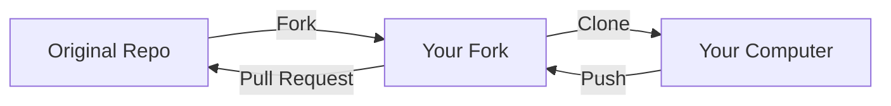

# Chapter 6: GitHub — Collaboration, Pull Requests, and Beyond

## What You'll Learn in This Chapter

- Understand the difference between Git and GitHub, and what GitHub adds on top of Git
- Navigate the GitHub interface: repositories, files, commits, and history
- Use Issues to track tasks, bugs, and ideas
- Create and review Pull Requests (PRs)
- Fork repositories and contribute to projects you don't own
- Use GitHub Actions for basic automation

## Git Is Not GitHub

You've been using Git for five chapters now — committing, branching, merging, pushing, pulling. All of that happened through Git, the version control system. But when you push to `github.com`, you're using GitHub, which is something different.

Git is the engine. It tracks changes, manages branches, handles merging. It runs on your computer, and it can run on any server.

GitHub is a platform built on top of Git. It adds things that Git itself doesn't provide:

- A web interface to view your code and its history
- Collaboration tools: Issues, Pull Requests, code review
- Social features: profiles, followers, stars, forks
- Automation: GitHub Actions for CI/CD
- Hosting: static sites, package registries, project pages

Think of it this way: Git is the version control technology. GitHub is the website that makes version control usable by teams and communities. Other platforms like GitLab and Bitbucket do the same thing — they're different websites built on the same Git foundation.

This chapter focuses on GitHub specifically, because it's the most widely used. But the concepts — pull requests, code review, issue tracking — exist in similar forms on all Git hosting platforms.

## Your First Walk Through GitHub

### The repository page

When you visit a repository on GitHub (for example, `github.com/yourname/your-repo`), you'll see several key areas:

- **Code tab**: The default view. Shows the file tree, the README preview, and quick-access buttons for cloning, forking, and downloading
- **Commits link**: Shows the commit history with messages, authors, and timestamps
- **Branch selector**: A dropdown near the top-left that lets you switch between branches
- **The green "Code" button**: Provides clone URLs (HTTPS and SSH) and options to open in GitHub Desktop or VS Code

### Browsing code and history

Click any file to view its contents. At the top of the file view, you'll see:

- The commit that last modified this file
- A "History" button showing all commits that touched this file
- A "Blame" button showing who changed each line and when (useful for finding who introduced a bug)

### Comparing versions on GitHub

You can compare any two branches or commits directly in the browser by navigating to:

```
github.com/yourname/your-repo/compare/branch-a...branch-b
```

GitHub shows the full diff, file by file, with the same green/red coloring you see in `git diff`. This is especially useful before creating a pull request — you can preview exactly what changes you're proposing.

## Issues: Organizing Work

An Issue is GitHub's way of tracking tasks, bugs, feature requests, and ideas. Every repository has an Issues tab.

### Creating an Issue

Click "Issues" → "New Issue." Fill in:

- **Title**: A short, specific description of the problem or task
- **Description**: Details about what needs to be done, steps to reproduce a bug, or context for a feature request
- **Labels**: Tags like `bug`, `enhancement`, `documentation`, `help wanted` (these are customizable)
- **Assignees**: Who is responsible for this issue
- **Projects**: Optional — for grouping issues into larger initiatives

### Writing effective issues

A good issue is specific enough that someone else (or your future self) can pick it up and know exactly what to do. Here's a useful template:

```markdown
## Problem
The formula in Chapter 3, Section 2 uses the wrong variable name.
Currently shows `v = s/t` but should be `v = Δs/Δt`.

## Expected behavior
The formula should correctly represent average velocity.

## Location
File: `docs/chapters/03-viewing-history-diff-and-undo.md`
Section: "Comparing Differences"

## Suggested fix
Replace `v = s/t` with `v = Δs/Δt` and add a brief explanation of
why the delta notation matters.
```

### Closing issues with commits

You can automatically close an issue when a commit or pull request is merged by including the issue number with a keyword:

```bash
$ git commit -m "fix: correct velocity formula (closes #12)"
```

Keywords that work: `close`, `closes`, `closed`, `fix`, `fixes`, `fixed`, `resolve`, `resolves`, `resolved`. GitHub reads these from commit messages and pull request descriptions and automatically closes the referenced issue.

## Pull Requests: Proposing and Reviewing Changes

A Pull Request (PR) is the core collaboration mechanism on GitHub. It's a proposal to merge changes from one branch into another, with a built-in discussion and review process.

### Creating a Pull Request

The workflow:

```bash
# 1. Create a branch for your work
$ git switch -c fix/velocity-formula

# 2. Make your changes
# (edit the file)

# 3. Commit and push
$ git add chapters/03-viewing-history-diff-and-undo.md
$ git commit -m "fix: correct velocity formula (closes #12)"
$ git push -u origin fix/velocity-formula

# 4. Go to GitHub. You'll see a green banner:
#    "fix/velocity-formula had recent pushes"
#    Click "Compare & pull request"
```

On the PR creation page, you'll fill in:

- **Title**: A summary of what the PR does
- **Description**: Detailed explanation of the changes, motivation, and any relevant issue numbers
- **Reviewers**: People you want to review your code (if working in a team)
- **Labels**: Tags for categorization

### Reviewing a Pull Request

When someone creates a PR, reviewers can:

- **Comment**: Leave general feedback or questions
- **Approve**: Signal that the changes look good
- **Request changes**: Ask for specific modifications before merging

Comments can be made on the entire PR or on specific lines of code. Line-level comments are particularly useful for pointing out exactly what needs to change.

### Merging a Pull Request

After review, the PR can be merged. GitHub offers three merge strategies:

| Strategy | Result | When to use |
|----------|--------|-------------|
| **Merge commit** | Creates a new commit that combines both branches | When you want to preserve the full branch history |
| **Squash and merge** | Combines all commits into a single commit | When the branch has many small, messy commits that should be one clean entry |
| **Rebase and merge** | Replays each commit on top of the target branch | When you want a clean linear history without merge commits |

For a personal project with simple branches, "Squash and merge" is often the cleanest choice — each PR becomes one neat commit on `main`. For team projects where commit history matters, "Merge commit" preserves the most information.

### After merging

After a PR is merged:

- The branch is usually deleted automatically (you can change this in settings)
- The associated issue (if referenced with `closes #N`) is closed automatically
- The commit appears in the main branch's history

You can then delete the local branch:

```bash
$ git switch main
$ git pull
$ git branch -d fix/velocity-formula
```

## Forks: Contributing to Projects You Don't Own

What if you find a project on GitHub and want to contribute a fix or feature, but you don't have write access? This is where forks come in.

### What is a fork?

A fork is your personal copy of someone else's repository. It lives on your GitHub account. You can make any changes you want in your fork — it's yours. When you're happy with your changes, you send a Pull Request back to the original project.

### The fork workflow



Step by step:

```bash
# 1. On GitHub, click "Fork" on the original repository
#    This creates a copy under your account

# 2. Clone YOUR fork to your computer
$ git clone https://github.com/yourname/forked-repo.git
$ cd forked-repo

# 3. Add the original as a remote (called "upstream")
$ git remote add upstream https://github.com/original-owner/repo.git

# 4. Create a branch for your contribution
$ git switch -c fix/typo-in-readme

# 5. Make changes, commit, push to YOUR fork
$ git add README.md
$ git commit -m "fix: correct typo in README"
$ git push -u origin fix/typo-in-readme

# 6. Go to GitHub, create a Pull Request from your fork to the original repo

# 7. Keep your fork up to date with the original
$ git fetch upstream
$ git merge upstream/main
$ git push origin main
```

The key distinction: you push to `origin` (your fork), and you create the PR from your fork to the upstream repository. `upstream` is where you pull updates from; `origin` is where you push your work.

## Keeping Your Fork in Sync

Over time, the original repository will receive updates that your fork doesn't have. To stay current:

```bash
# Fetch the latest from the original repo
$ git fetch upstream

# Merge into your local main
$ git switch main
$ git merge upstream/main

# Push to your fork
$ git push origin main
```

Do this before starting new work on your fork. If the original has moved forward significantly, resolving conflicts is easier when your fork is up to date.

## GitHub Actions: Automation Basics

GitHub Actions is GitHub's built-in automation system. It can run tests, build websites, deploy code, and more — triggered by events like pushes, pull requests, or schedules.

### How Actions work

An Action is defined in a YAML file stored in your repository at `.github/workflows/`. Each workflow specifies:

- **Trigger**: When to run (on push, on PR, on schedule, etc.)
- **Jobs**: What to do (run tests, build, deploy)
- **Steps**: The individual commands within each job

### A simple example: Auto-check links on push

```yaml
name: Check Links
on:
  push:
    branches: [main]
jobs:
  check:
    runs-on: ubuntu-latest
    steps:
      - uses: actions/checkout@v4
      - uses: gaurav-nelson/github-action-markdown-link-check@v1
```

This workflow runs every time you push to `main`. It checks all markdown files for broken links. If a link is broken, the workflow fails and you'll see a red X on the commit.

### Viewing workflow results

After pushing, go to the "Actions" tab on your repository. You'll see a list of workflow runs. Click any run to see its status, logs, and results.

Actions is a deep topic — entire books have been written about CI/CD pipelines. For now, the key takeaway is that GitHub can automatically run checks on your code every time you push. This catches problems early and keeps your project reliable.

## Common Problems and Solutions

**Problem 1: I accidentally pushed sensitive data (passwords, API keys) to GitHub.**

Remove the data and force push:

```bash
# Remove the file from history
$ git filter-branch --force --index-filter \
  "git rm --cached --ignore-unmatch secrets.json" \
  --prune-empty --tag-name-filter cat -- --all

# Force push
$ git push --force origin main
```

Then immediately rotate the compromised credentials. Even after removing from Git, the data may have been cached. Treat any exposed secret as compromised.

For newer repositories, consider using `git filter-repo` instead of `git filter-branch`.

**Problem 2: My Pull Request shows changes I didn't make.**

This usually means your branch includes commits from `main` that you didn't intend. Rebase your branch onto the latest `main`:

```bash
$ git fetch origin
$ git rebase origin/main
$ git push --force-with-lease origin your-branch
```

**Problem 3: I can't push to a repository.**

Check that you have write access. If it's someone else's repository, you need to fork it first, push to your fork, then create a Pull Request.

If you do have access and still can't push, check your authentication:

```bash
# Test your connection
$ ssh -T git@github.com
# Or check your HTTPS credentials
$ git remote -v
```

**Problem 4: A merged PR's changes look wrong on `main`.**

This can happen if there were conflicts during merge that were resolved incorrectly. Check the merge commit:

```bash
$ git show <merge-commit-id>
```

If needed, revert the merge:

```bash
$ git revert -m 1 <merge-commit-id>
$ git push origin main
```

**Problem 5: I want to contribute to a project but don't know where to start.**

Look for issues labeled `good first issue` or `help wanted`. These are specifically marked for new contributors. Read the contributing guidelines (usually in a `CONTRIBUTING.md` file), and don't hesitate to ask questions in the issue comments before starting work.

## Chapter summary

Git is the version control engine; GitHub is the collaboration platform built on top of it. GitHub provides a web interface, Issues for task tracking, Pull Requests for code review, forks for contributing to projects you don't own, and Actions for automation.

Issues organize work with titles, descriptions, labels, and assignees. You can reference issues in commit messages with `closes #N` to auto-close them.

Pull Requests are proposals to merge changes with built-in review. The three merge strategies — merge commit, squash and merge, rebase and merge — each produce different history shapes. After merging, delete the feature branch.

Forks let you contribute to repositories you don't own. The workflow is: fork → clone your fork → create a branch → push to your fork → create a PR to the original. Keep your fork in sync by regularly fetching and merging from `upstream`.

GitHub Actions runs automated workflows triggered by repository events. Workflows are defined in `.github/workflows/` as YAML files.

## Next steps

Over six chapters, you've gone from zero Git knowledge to being able to work with branches, remotes, and GitHub collaboration. The final chapter will tie everything together with practical workflows — from personal project management to team collaboration patterns. You'll see how all the individual commands and concepts combine into real-world development habits.
