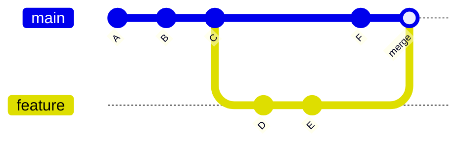
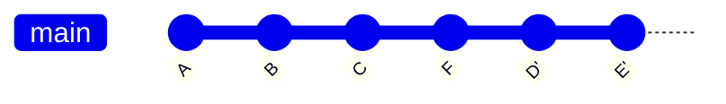
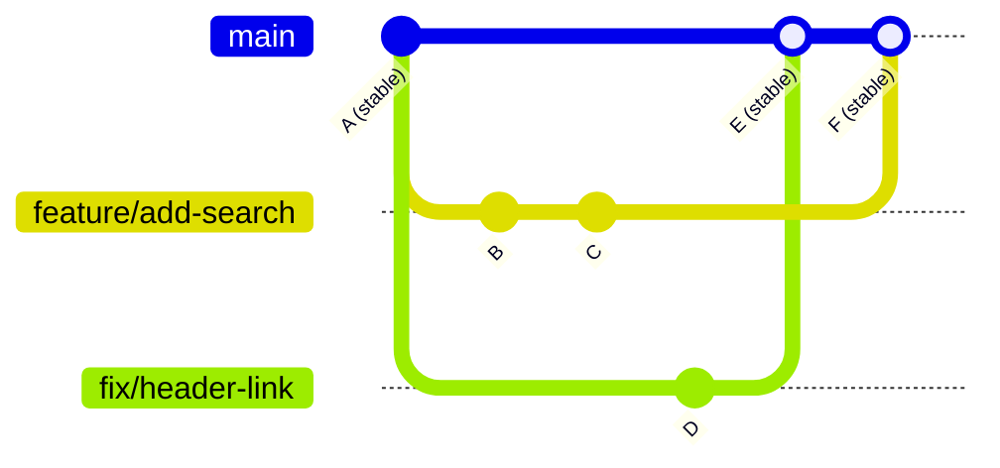

# Chapter 7: Putting It All Together — Real-World Workflows

## What You'll Learn in This Chapter

- How to combine individual Git commands into consistent daily habits
- A personal project workflow for solo developers
- What `git rebase` does, when to use it, and why to be careful
- A team collaboration workflow with branch strategies and code review
- How to use tags and GitHub Releases for version management
- How to structure a `.gitignore` file

## You Know the Moves. Now Learn the Choreography

Over the past six chapters, you've learned a lot of individual tools: `git init`, `git add`, `git commit`, `git branch`, `git switch`, `git merge`, `git stash`, `git fetch`, `git pull`, `git push`, Issues, Pull Requests, Forks. Each one makes sense on its own. But knowing the moves isn't the same as being able to dance.

This chapter is about choreography — how to combine these tools into workflows that you can repeat every day without thinking about it. We'll cover three levels: a personal workflow for your own projects, rebase (a tool you've seen mentioned but haven't formally learned), and a team collaboration workflow.

## Personal Project Workflow

When you're working alone on a project, the workflow is simple but consistency matters. Here's a reliable daily pattern.

### Before you start working

```bash
# Make sure you're on main and up to date
$ git switch main
$ git pull origin main
```

This ensures your local `main` matches the remote. If you made changes on another machine or the remote was updated some other way, this catches you up.

### When you start a new task

```bash
# Create a branch for the task
$ git switch -c feature/your-task-name
```

Even in a personal project, branching for each task is worth it. It keeps your `main` clean, lets you switch between tasks with `git stash`, and means you never have to worry about accidentally committing unrelated changes together.

### While you're working

```bash
# Commit often, with clear messages
$ git add file-you-changed.md
$ git commit -m "add: introduction section for chapter 7"
```

Commit when you reach a natural stopping point — a section finished, a bug fixed, a feature working. Small, focused commits are easier to understand and undo than large ones.

If you need to switch tasks mid-way:

```bash
$ git stash push -m "chapter 7 intro, half done"
$ git switch other-task
# ... work on other task ...
$ git switch feature/your-task-name
$ git stash pop
```

### When you're done with a task

```bash
# Switch to main and merge
$ git switch main
$ git merge feature/your-task-name

# Push
$ git push origin main

# Clean up
$ git branch -d feature/your-task-name
```

For personal projects, this is usually sufficient. No Pull Request needed — you're both the author and the reviewer. Keep it simple.

### The daily rhythm

If you do one thing consistently, make it this: **never commit directly on `main`.** Always branch, even for tiny changes. This habit will save you countless times when a quick fix turns into a bigger task, or when you need to switch context unexpectedly.

## Understanding Rebase

You've seen `git rebase` mentioned a few times in this book — in merge strategies, in force-push warnings, in keeping forks in sync. Now it's time to understand what it actually does.

### What merge does vs what rebase does

Both `git merge` and `git rebase` integrate changes from one branch into another. They produce the same end result (all the same changes are present), but they create different histories.

**Merge** creates a merge commit — a new commit that has two parents:



The history shows exactly what happened: `main` got commit F, `feature` got D and E, then they were merged. The merge commit preserves the timeline.

**Rebase** takes your branch's commits and replays them on top of the other branch:



The history is a straight line. Commit F comes first, then D' and E' are replayed on top. The merge commit is gone. The end result is the same code, but the history looks like everything was developed sequentially.

### The rebase command

```bash
# Rebase your current branch onto main
$ git switch feature
$ git rebase main
```

This takes all commits on `feature` that aren't on `main` (D and E), saves them temporarily, moves the `feature` pointer to `main`'s tip (F), then replays D and E on top. The resulting commits get new hashes (D' and E') because they're technically new commits, even though the changes are the same.

### The golden rule of rebase

**Never rebase commits that have been pushed and shared with others.**

Rebase rewrites history — it creates new commit hashes. If someone else has already pulled your original commits, and you rebase and force push, their local history will conflict with the rewritten history. This creates confusion and broken repositories.

Rebase is safe in these situations:

- You're rebasing your local branch onto an updated `main` before pushing
- You're cleaning up your own local commits before creating a PR
- You're working on a personal branch that nobody else uses

Rebase is dangerous in these situations:

- The commits have been pushed to a shared branch
- Other people are working on the same branch
- The commits have been included in a Pull Request that others have reviewed

### Interactive rebase

`git rebase -i` (interactive rebase) lets you modify your recent commits — reorder them, combine them, edit their messages, or remove them entirely. It's one of Git's most powerful tools for keeping your history clean.

```bash
# Rebase the last 3 commits interactively
$ git rebase -i HEAD~3
```

This opens your editor with a list of the last 3 commits:

```
pick d4a5e6f add: introduction section
pick f7b8c1d add: personal workflow section
pick a2e3f4b fix: typo in rebase explanation
```

You can change `pick` to other commands:

- `reword` — keep the commit but change its message
- `squash` — combine this commit into the previous one
- `drop` — remove this commit entirely
- `reorder` — move lines up or down to change commit order

For example, if the typo fix is trivial and shouldn't be its own commit:

```
pick d4a5e6f add: introduction section
pick f7b8c1d add: personal workflow section
fixup a2e3f4b fix: typo in rebase explanation
```

`fixup` works like `squash` but discards the commit message. After saving and closing, the typo fix is merged into the previous commit. Your history is now cleaner.

## Team Collaboration Workflow

When multiple people work on the same repository, you need more structure. Here's a common approach that works well for small to medium teams.

### Branch strategy

A simple and effective strategy:

- `main` — always stable, always deployable. Only merged into through PRs, never committed to directly.
- `feature/*` — for new features or content. One branch per task. Created from `main`, merged back via PR.
- `fix/*` — for bug fixes. Same rules as feature branches.
- `experiment/*` — for risky or exploratory work. Can be abandoned without consequence.



The key principle: `main` only moves forward through merges, never through direct commits. This means `main` is always in a known-good state.

### The PR workflow

When working on a team, every change goes through a Pull Request:

```bash
# 1. Start from an up-to-date main
$ git switch main
$ git pull origin main

# 2. Create a feature branch
$ git switch -c feature/add-search

# 3. Work and commit
# (make changes, add, commit with clear messages)

# 4. Push and create a PR
$ git push -u origin feature/add-search
# Then create PR on GitHub

# 5. Address review feedback
# (make more commits if needed, push again)

# 6. After PR is merged, clean up locally
$ git switch main
$ git pull origin main
$ git branch -d feature/add-search
```

### Code review habits

Good code review is a skill. Here are some principles:

- **Review the PR, not the person.** Focus on the code changes, not who wrote them.
- **Be specific.** "This doesn't look right" is less helpful than "This variable name is misleading because it actually holds the count, not the total."
- **Distinguish between blocking and non-blocking comments.** A blocking comment means "this must be fixed before merging." A non-blocking comment is a suggestion or question.
- **Review promptly.** A PR that sits for days without review slows down the entire team.
- **Keep PRs small.** A PR that changes 50 lines is easier to review than one that changes 500. If your PR is large, consider splitting it.

## Tags and Releases

When your project reaches a meaningful milestone — a version you want to mark, a release you want to share — tags and GitHub Releases are the tools to use.

### Git tags

A tag is a permanent marker on a specific commit. Unlike branch pointers, tags don't move. They stay fixed on the commit they were created on.

```bash
# Create a lightweight tag
$ git tag v1.0.0

# Create an annotated tag (recommended — includes message and author)
$ git tag -a v1.0.0 -m "First stable release: all core chapters complete"

# Push tags to remote
$ git push origin v1.0.0

# Push all tags
$ git push origin --tags

# List tags
$ git tag

# View tag details
$ git show v1.0.0
```

Use annotated tags (`-a`) instead of lightweight tags. Annotated tags store the tagger's name, email, date, and message — important metadata for releases. Lightweight tags are just a name pointing to a commit, with no additional information.

### GitHub Releases

A GitHub Release builds on top of a Git tag. It adds:

- A human-readable description of what changed
- Binary attachments (compiled files, archives, etc.)
- A dedicated page that users can visit

To create a release:

1. Go to your repository on GitHub
2. Click "Releases" → "Draft a new release"
3. Choose or create a tag (e.g. `v1.0.0`)
4. Write a title and description
5. Optionally attach files
6. Click "Publish release"

You can also create releases from the command line using the GitHub CLI (`gh`):

```bash
# Create a release
$ gh release create v1.0.0 --title "v1.0.0" --notes "First stable release"
```

### Version numbering: Semantic Versioning

Semantic Versioning (SemVer) is a convention for numbering your releases:

```
MAJOR.MINOR.PATCH
  1   . 0  . 0
```

- **MAJOR**: Breaking changes (incompatible API changes, removed features)
- **MINOR**: New features that are backward-compatible
- **PATCH**: Bug fixes that are backward-compatible

Examples:

- `1.0.0` → `2.0.0`: Rewrote the entire API, old code won't work
- `1.0.0` → `1.1.0`: Added a new search feature, existing code still works
- `1.0.0` → `1.0.1`: Fixed a crash on page load

For a documentation project like a textbook, you might simplify this:

- `1.0.0`: First complete version (all chapters done)
- `1.1.0`: Added a new chapter or major revision
- `1.1.1`: Fixed typos or errors

## The `.gitignore` File

Not every file belongs in Git. Build artifacts, system files, secrets, and temporary files should be excluded. `.gitignore` tells Git which files to ignore.

### Common entries

```gitignore
# System files
.DS_Store
Thumbs.db

# Editor files
.vscode/
.idea/
*.swp

# Dependencies
node_modules/

# Build output
dist/
build/

# Environment and secrets
.env
.env.local
secrets.json
```

### Rules for `.gitignore`

- One pattern per line
- `#` starts a comment
- `*.log` ignores all files ending in `.log`
- `build/` ignores the entire `build` directory
- `!important.log` negates — tracks `important.log` even if other `.log` files are ignored
- Patterns are relative to the `.gitignore` file's location

### If you already tracked a file you should have ignored

Adding a file to `.gitignore` doesn't stop tracking it if it's already committed. You need to remove it from Git's tracking:

```bash
# Remove from tracking (keep the file on disk)
$ git rm --cached file.log

# Remove an entire directory from tracking
$ git rm -r --cached dist/

# Commit the change
$ git commit -m "chore: stop tracking dist/ directory"
```

GitHub provides a collection of ready-made `.gitignore` templates at `github.com/github/gitignore` for many languages and frameworks.

## Common Problems and Solutions

**Problem 1: I've been committing on `main` and now realize I should have used a branch.**

Create a branch at your current state and reset `main` back:

```bash
$ git branch my-work          # save current state as a branch
$ git reset --hard HEAD~3     # move main back 3 commits (adjust number)
```

Now `my-work` has your commits and `main` is clean.

**Problem 2: My rebase went wrong and everything is a mess.**

You can always undo a rebase:

```bash
$ git reflog
# Find the commit before the rebase (look for "HEAD@{N}")
$ git reset --hard HEAD@{N}
```

The reflog keeps a record of every HEAD movement for 90 days. Even after a bad rebase, your original commits are still recoverable.

**Problem 3: I accidentally pushed to the wrong branch.**

Move the commit to the correct branch:

```bash
$ git branch correct-branch         # save the commit
$ git reset --hard HEAD~1           # remove from current branch
$ git push --force-with-lease origin current-branch  # fix remote
$ git switch correct-branch
$ git push -u origin correct-branch
```

**Problem 4: Team member's PR conflicts with my recent changes.**

Coordinate with the team member. Have them rebase onto the latest `main`:

```bash
$ git switch main
$ git pull origin main
$ git switch their-branch
$ git rebase main
$ git push --force-with-lease origin their-branch
```

This is safe because `--force-with-lease` ensures nobody else has pushed to that branch in the meantime.

**Problem 5: I want to see a summary of what changed between two releases.**

Use `git log` with tag names:

```bash
# Changes between two tags
$ git log v1.0.0..v1.1.0 --oneline

# Detailed changes
$ git log v1.0.0..v1.1.0 --stat
```

This is useful for writing release notes.

## Chapter Summary

A workflow is how you combine individual Git commands into a repeatable process. For personal projects: branch for each task, commit often, merge to `main`, push, clean up. The key habit is never committing directly on `main`.

`git rebase` replays commits on top of another branch, creating a linear history instead of a merge commit. It's safe for local, unshared commits. The golden rule: never rebase commits that others have pulled. Interactive rebase (`git rebase -i`) lets you edit, combine, reorder, or remove recent commits.

Team collaboration needs structure: `main` stays stable and only receives merges, every change goes through a PR, code review should be prompt and specific, and PRs should be small and focused.

Tags mark important commits permanently. Use annotated tags (`git tag -a`) for releases. GitHub Releases add descriptions and attachments on top of tags. Semantic Versioning (`MAJOR.MINOR.PATCH`) provides a consistent version numbering convention.

`.gitignore` excludes files that shouldn't be tracked — system files, build artifacts, secrets, and temporary files. Use `git rm --cached` to stop tracking files that are already committed.

## Where to Go From Here

Seven chapters ago, you might have wondered why version control is worth the effort. By now, you've seen the answer: it's not just about backing up files. It's about being able to work confidently — knowing you can undo mistakes, try experiments safely, collaborate without stepping on each other's toes, and look back at any point in your project's history.

The commands you've learned are tools. The workflows in this chapter are habits. The real skill comes from practice — using Git daily until the commands become muscle memory and the workflows become second nature.

You don't need to memorize everything. Keep this book handy as a reference. When you forget a flag or a workflow step, look it up. Over time, you'll need it less and less.

Good luck, and happy committing.
