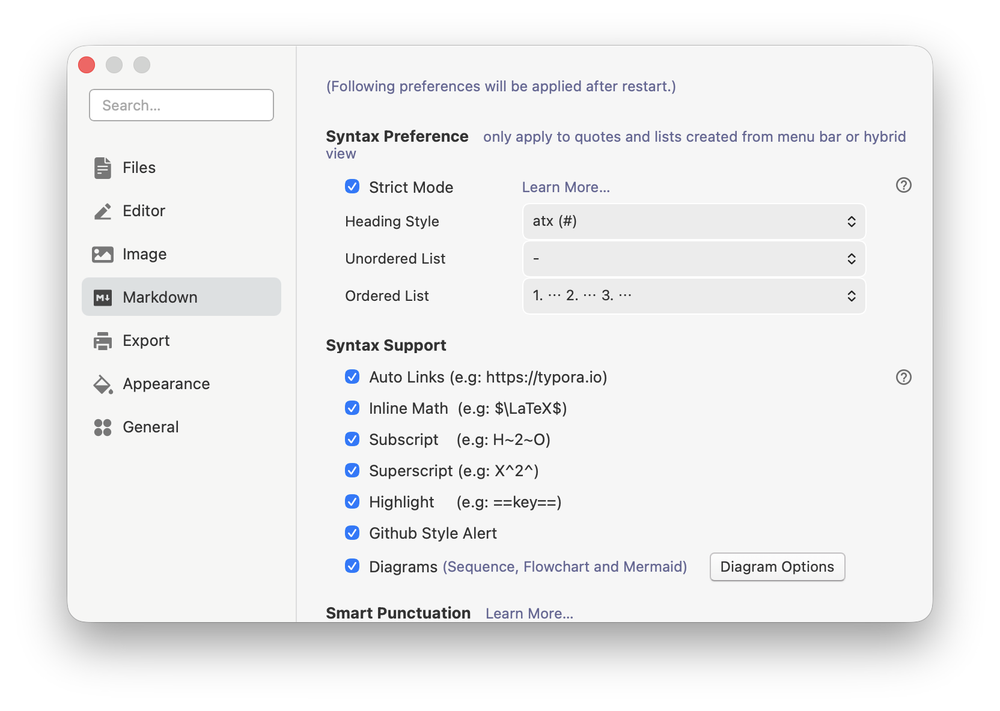
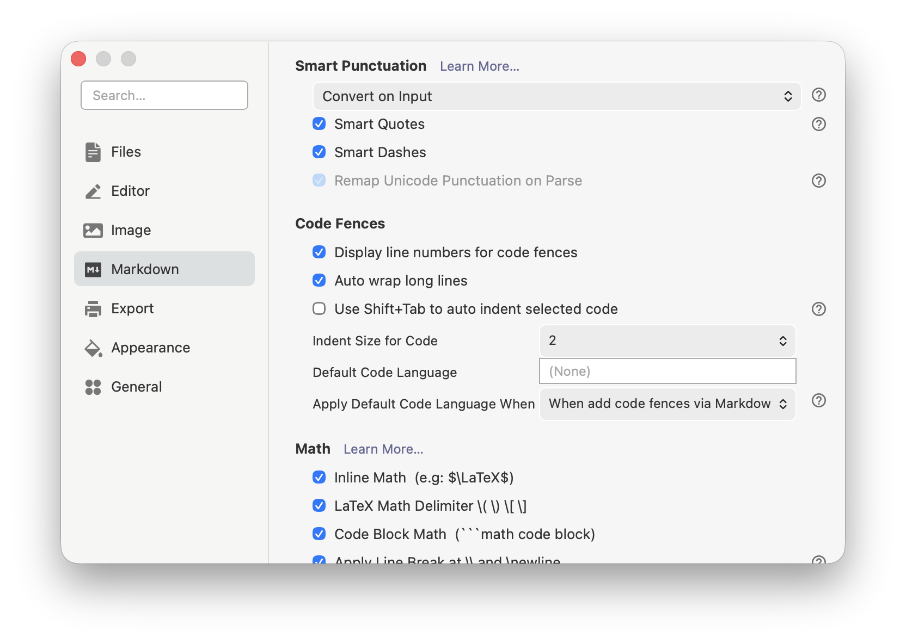
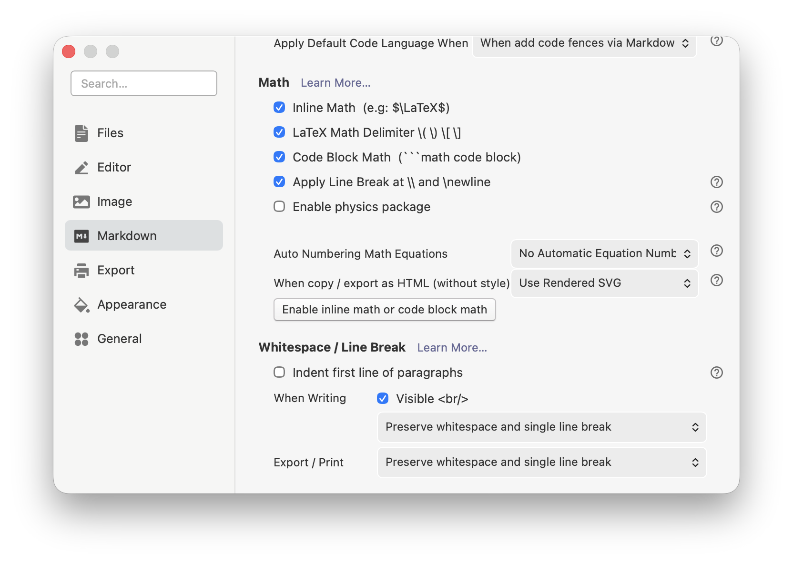
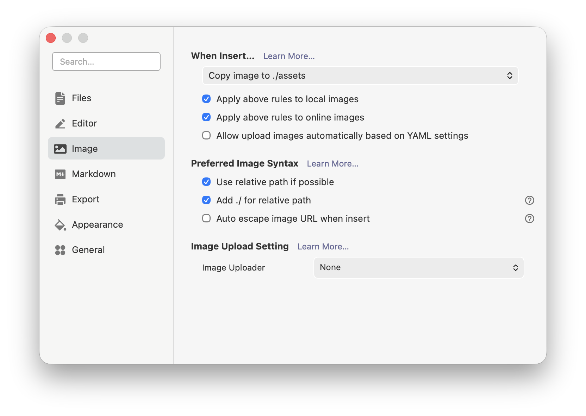
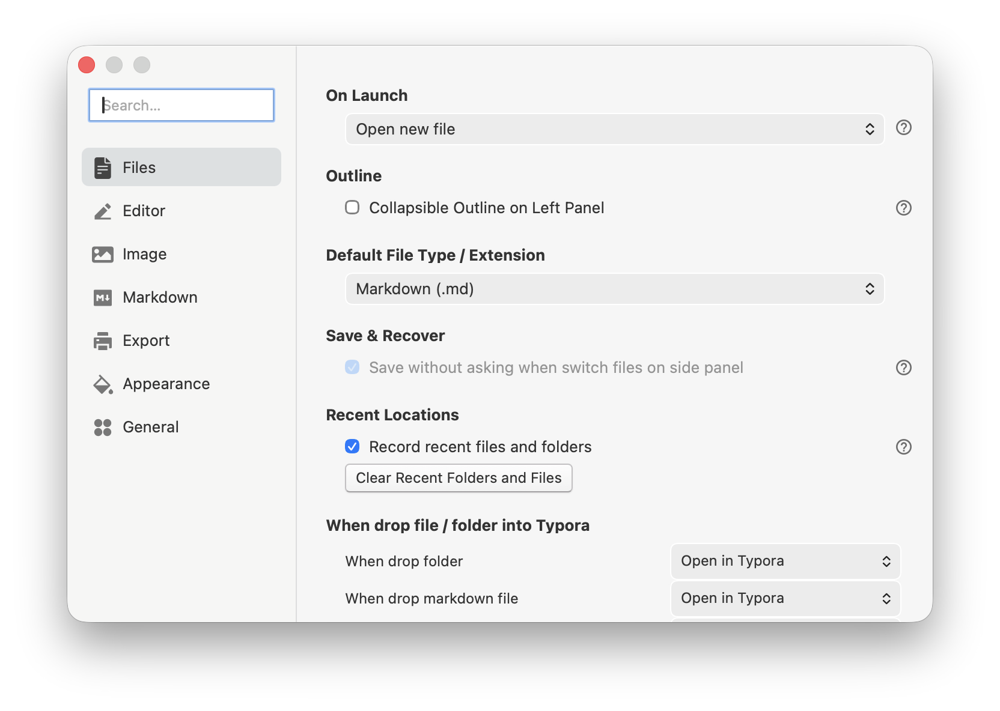
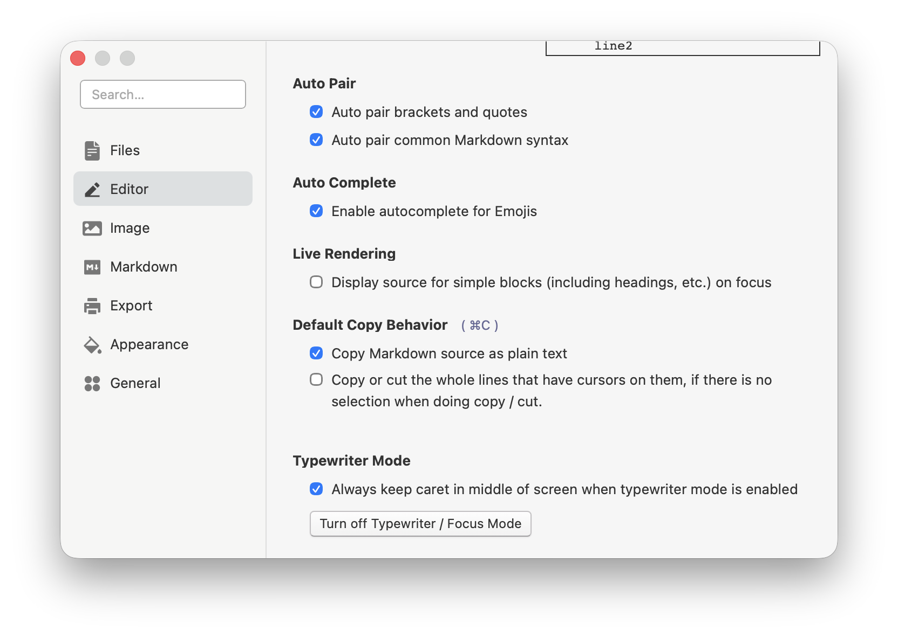

# Chapter 3: Getting Started with Real Writing — Markdown Basics, LaTeX Formulas, and Typora Settings


## 1. Why this chapter combines "syntax" and "settings"

Many people learning Markdown split the process in half: the first half is memorizing syntax, the second half is exploring the software. On the surface, this division seems natural, because syntax feels like "knowledge" and settings feel like "tools." But for people who truly want to write documents long-term, these two things are actually inseparable. Because ultimately you're not learning Markdown in the abstract — you're writing it, viewing it, and managing it in a specific tool. When you write headings, lists, code blocks, tables, and formulas, the real problems you encounter are often not "do I know this symbol," but rather "why isn't this displaying as I expected," "why does it look different on another platform," "why does it work in Typora but look weird on GitHub," "why can I type the formula but it still doesn't feel smooth."

So this chapter's goal is not to train you to memorize symbols, but to bring you into a more practical state: you not only know what Markdown basic syntax looks like, but also know how to write LaTeX formulas in Typora, when to enable which settings, which settings directly affect your writing experience, and where you should reserve space for illustrations when making screenshots, tutorials, and teaching materials later.

If Chapter 1 was about "why write this way," and Chapter 2 was about "how to build a stable material structure," then this chapter is about: **when you actually sit down to write documents, what exactly should you do.**

## 2. Establish the correct learning order: skeleton first, formulas second, settings last

The most common mistake beginners make is immediately focusing attention on the most feature-rich areas. For example, as soon as they open Typora, they rush to study themes, sidebars, export styles, formula auto-numbering, task lists, table alignment, math environments, YAML, footnotes, and image hosting. The problem with this approach isn't "learning too much," but "learning without order."

For documents you truly want to maintain long-term, what determines quality first is always the most basic structural syntax: headings, paragraphs, lists, blockquotes, code blocks, links, images, and tables. Only after you've mastered these things will LaTeX formulas become a bonus rather than noise; and Typora settings will become an efficiency enhancer rather than a distracting control panel.

Therefore, this chapter suggests you absorb in the following order:

1. First master Markdown's most basic document skeleton syntax.
2. Then understand how to input LaTeX formulas in Typora.
3. Finally handle Typora settings uniformly, letting the tool support your writing rather than making you adapt to the tool.

This order looks simple, but its value is very high. Because once the order is right, every feature you learn later will help you understand which type of writing ability it enhances, rather than drowning yourself in a pile of buttons and menus.

## 3. Markdown basics: first learn "how documents stand up"

### 1. Headings: learn hierarchy first, not font size

The most important thing about Markdown headings isn't "how big they look," but "which level they belong to." In long-term documents like teaching materials, tutorials, notes, and project documentation, headings serve as the structural skeleton. Level 1 headings correspond to the main topic of the entire article, level 2 headings correspond to major sections, level 3 headings correspond to finer subsections, and further down are even finer divisions.

The most common and most reliable approach is to use ATX-style headings starting with `#`:

```markdown
# Level 1 Heading
## Level 2 Heading
### Level 3 Heading
```

In Typora, after you type the hash symbol and heading text and press Enter, Typora automatically converts it to a heading. This process is very smooth, so many people easily overlook the structural significance behind it. You must remember: headings are not decorative enlarged text, but outline nodes of the article. The clearer your headings, the easier outline view, table of contents generation, section navigation, and long-term maintenance will be later.


> **Figure 3-1**: Typora editing area with outline sidebar showing heading hierarchy (levels 1, 2, and 3)

### 2. Paragraphs and line breaks: first distinguish "new paragraph" from "inline line break"

The second most confusing point for Markdown beginners is paragraphs versus line breaks. Many people are used to pressing Enter in Word to create visual effects, so when they come to Markdown, they instinctively understand "pressing Enter" as "starting a new layer of meaning." But Markdown's approach emphasizes structure more: paragraphs are content units, inline line breaks are just formatting effects.

In Typora, a normal Enter is usually sufficient to start a new paragraph; if what you need is a forced line break within a paragraph, the more common approach is to use `Shift + Enter`, or follow the Markdown-compatible method of adding two spaces at the end of a line before breaking, or explicitly insert `<br>`.

This seems like a small thing, but it actually greatly affects writing quality. Because if you mix paragraphs and line breaks together, your document will exhibit two extremes: either a whole block of text with no breathing room, or every sentence broken up into fragments. The truly mature approach is to let paragraphs carry "a relatively complete idea," and let inline line breaks appear only when truly necessary.

### 3. Lists: they express "parallel" and "sequence"

Lists are one of the most commonly used and easiest structures in Markdown for creating hierarchy. Lists are divided into two types:

- Unordered lists: suitable for expressing parallel items.
- Ordered lists: suitable for expressing steps, processes, and sequential relationships.

For example, unordered list:

```markdown
- Install Typora
- Create new document
- Save as Markdown file
```

Ordered list:

```markdown
1. Open Typora
2. Enter heading
3. Write body text
4. Insert image
```

The real difficulty with lists isn't single-level lists, but nested lists. When you continue listing sub-items under a list item, indentation becomes important. You need to gradually develop a concept: **indentation in Markdown isn't a spacing game, but expresses hierarchy.**


> **Figure 3-2**: Unordered lists, ordered lists, and nested lists

### 4. Blockquotes: not gray box decoration, but "another layer of voice"

Markdown blockquotes start with `>`. When many people first learn blockquotes, they only notice it becomes a block with a border line, as if it's just to make the page look better. Actually, the true value of blockquotes is to let the main text temporarily switch to another kind of voice. For example, you can use it for tips, definitions, warnings, teacher comments, original text excerpts, or supplementary explanations.

```markdown
> This is a blockquote content.
```

In tutorials and teaching materials, blockquotes are especially useful. Because you often need to separate "main narrative" from "extra reminders." If everything is written as normal paragraphs, readers can't distinguish which part is the main thread and which part is just supplementary reminder.

### 5. Code blocks: let text and code each have their place

As long as documents involve commands, configurations, example input/output, file structure, or program code, code blocks are almost unavoidable. The most common Markdown approach is fenced code blocks, using three backticks:

````markdown
```python
print("Hello, Typora")
```
````

The importance of this approach is that it can clearly separate "body text explanation" from "raw code/commands." Otherwise readers will find it very tiring, and copying will be inconvenient.

In Typora, after you type three backticks and press Enter, a code block is automatically generated; if you write a language name directly after the backticks, such as `python`, `bash`, `json`, Typora will try to provide syntax highlighting.


> **Figure 3-3**: Python and Bash code blocks with syntax highlighting


> **Figure 3-4**: JSON code block with syntax highlighting

### 6. Links and images: they are resource connections, not just format features

The core function of links is to connect documents with other resources. The most common inline link syntax is:

```markdown
[Typora Official Site](https://typora.io)
```

Images are essentially "links with display behavior":

```markdown

```

The habit truly worth developing isn't just "I can insert images," but "I know why this image path is written this way." If you write image paths as absolute paths that only work on your current computer, this image is almost destined to break eventually. Relative paths are the truly stable approach for teaching material repositories.

### 7. Tables: suitable for comparisons, but not for carrying all expression

Markdown tables are very common and very practical, especially suitable for "syntax vs. function," "feature vs. scenario," "setting item vs. recommended value" type comparison information. Basic syntax is as follows:

```markdown
| Syntax | Function |
| --- | --- |
| # Heading | Represents level 1 heading |
| - List | Represents unordered list |
```

But you should also know that tables aren't universal containers. Many people, once they learn tables, want to stuff everything into them. The result is readers find it very tiring, because once text volume is large and explanations are many, tables actually make information cramped. So tables are most suitable for "side-by-side comparison," not for long explanations.

### 8. Footnotes, strikethrough, inline emphasis: these are enhancements, not skeleton

After you've mastered headings, paragraphs, lists, blockquotes, code blocks, images, and tables fairly well, using bold, italic, strikethrough, and footnotes will become more natural. Because these features are more like rhetoric and supplements, not the document's main structure.

You need to gradually form a judgment:

- Headings, paragraphs, lists, and code blocks determine whether a document "stands up."
- Bold, italic, strikethrough, and footnotes determine whether a document is "detailed."

Don't reverse this order. Otherwise you'll easily end up with "lots of formatting, but messy structure."

## 4. LaTeX formula syntax: don't treat it as advanced magic

Many beginners get nervous when they see formulas, feeling that LaTeX formula syntax belongs to the territory of "math professionals." Actually, for general document writers, what you'll use most often is only a very small part of it. Typora supports TeX / LaTeX style syntax and renders formulas through MathJax. You don't need to master complex environments from the start, just learn the most common and stable formula writing methods first.

### 1. Inline formulas: first learn to put formulas inside sentences

Inline formulas use single dollar signs:

```markdown
$f = \frac{2\pi}{T}$
```

This is suitable for scenarios where "the formula is just part of a sentence." For example, when explaining period, area, velocity, or probability, you often don't need the formula to occupy a whole line by itself, but just want it embedded in the narrative. In this case, inline formulas are very useful.

But note that Typora's inline formula feature usually needs to be explicitly enabled in settings. That is, just because you see others can type `$...$` doesn't mean you currently have this feature enabled by default. So when writing formulas, if you find the output isn't as expected, don't immediately suspect you wrote it wrong — also check whether the setting is enabled.


> **Figure 3-5**: Typora Markdown settings showing Inline Math option (top) and inline formulas rendered in body text (bottom)

### 2. Display formulas: let formulas stand out on their own

When a formula itself is relatively long, or you want it to stand alone as a display object, you should use display formulas. The most common approach for display formulas is to wrap them with a pair of `$$`:

```markdown
$$
E = mc^2
$$
```

The biggest advantage of display formulas is they're very clear visually, suitable for explaining derivations, definitions, equation relationships, matrices, and multi-line formulas. For teaching materials and tutorials, as long as you start seriously writing math, algorithms, statistics, physics, engineering, or machine learning related content, display formulas will almost certainly be used.

### 3. Fractions, superscripts, subscripts: these are the first three forms to master

The vast majority of basic formulas can actually be broken down into three most common expressions:

- Fractions: `\frac{a}{b}`
- Superscripts: `x^2`
- Subscripts: `a_1`

For example:

```markdown
$\frac{a+b}{c}$
$x^2 + y^2 = z^2$
$a_1, a_2, \dots, a_n$
```

The reason many people find formulas difficult isn't because these symbols themselves are hard, but because they see too many unfamiliar commands at once. Actually, if you practice breaking down the most common structures separately, you'll quickly find they're not mysterious.

### 4. Summation, integration, square root, parentheses: gradually add common structures

Going one step further, what you'll most commonly use are probably these:

```markdown
$\sum_{i=1}^{n} i$
$\int_a^b f(x)\,dx$
$\sqrt{x^2+y^2}$
$\left( \frac{a}{b} \right)$
```

What's most worth your attention here isn't mechanically memorizing, but understanding structural relationships:

- `\sum` is the summation symbol.
- `\int` is the integration symbol.
- `\sqrt{}` is the square root.
- `\left(` and `\right)` are commonly used to make parentheses automatically adjust to formula height.

### 5. Multi-line formulas and alignment: this is the most worthwhile layer to learn in display formulas

When you need to show derivation processes, single-line formulas aren't enough. The most common approach then is to use `align` or related environments, for example:

```markdown
$$
\begin{align}
a+b &= c \\
d &= e+f
\end{align}
$$
```

The value of multi-line formulas is that they can make derivation steps truly readable, rather than cramming all equations into one line. For teaching material writing, this point is especially critical. Because truly "knowing how to explain" isn't just presenting the final answer, but letting readers see the transformation process clearly.


> **Figure 3-6**: Display formulas (with auto-numbering) and multi-line aligned formulas

### 6. Auto-numbering, cross-references, physics package, chemical expressions: belong to second-tier capabilities

Typora's math support doesn't just stop at "being able to render formulas." According to official documentation, it also supports:

- Formula auto-numbering
- Cross-references
- Physics package
- Chemical expressions (mhchem)

These features are powerful, but you don't need to rush to absorb them all now. For most beginners, in the first stage, just getting inline formulas, display formulas, fractions, superscripts/subscripts, square roots, summation, integration, and multi-line alignment stable is already enough to cover a large number of actual scenarios. Auto-numbering and cross-references can be explored later when you're truly writing long documents or academic-style materials.

## 5. Typora settings: getting the tool into a state truly "suitable for writing teaching materials"

Many people, after installing Typora, just use default settings all the way through. Default settings certainly aren't unusable, but if you plan to make Typora your long-term main tool, then at least several categories of settings are worth carefully reviewing once. The most important principle here isn't "research every toggle," but knowing which settings will directly change your writing experience.

### 1. Look at Markdown-related settings first, not themes

Beginners are most easily attracted first by themes, colors, and fonts, which is natural because these are most intuitive. But what's most important for actual writing is usually Markdown-related settings. You should at least prioritize caring about the following:

- Whether to enable inline formulas
- Whether to enable footnotes
- Whether to enable superscript/subscript, highlight, and other extended syntax
- Whether math formulas auto-number
- Whether to enable physics package
- Whether to copy images to specified directory when inserting
- Whether image paths use relative paths

These toggles don't look as prominent as theme switching, but they actually determine whether your document is stable, smooth, and suitable for long-term maintenance.



> **Figure 3-7**: Typora Markdown syntax support settings, including Inline Math, Subscript, Superscript, Highlight, and Diagrams options

### 2. Settings directly related to formulas should be unified in advance

If you're certain you'll be writing math, algorithms, statistics, physics, engineering, or machine learning content later, then settings related to formulas should be unified from the start as much as possible. Typical ones include:

- Whether to enable Inline Math
- Whether to enable physics package
- Which mode to use for math formula auto-numbering
- Whether cross-reference habits are needed

The benefit of unifying these settings isn't just "looking more professional," but avoiding inconsistent behavior across your documents later. Especially when making teaching materials, having numbering in one chapter but not another, inline formulas rendering in one place but not another, will tire both readers and authors.



> **Figure 3-8**: Typora Markdown settings for Code Fences and Math options



> **Figure 3-9**: Typora Math detailed settings, including Inline Math, LaTeX Math Delimiter, and Auto Numbering options

### 3. Image-related settings are key settings for teaching material workflow

If you only write short notes, maybe image strategy isn't that prominent. But as long as you want to write tutorials, teaching materials, or documentation with screenshots, image settings are a category of options that must be handled in advance. Most worth prioritizing are:

- Whether to automatically copy to target folder when inserting local images
- Whether to use relative paths
- How to handle image root path
- Whether coordination with YAML Front Matter is needed

Once you handle these items in advance, you won't easily fall into the disaster of "images displayed at the time, but all broke later" when inserting images.



> **Figure 3-10**: Typora image settings showing image insertion paths, relative path options, and Image Uploader settings

### 4. Outline, file tree, word count — these views aren't icing on the cake, but your workbench when writing long documents

One of Typora's advantages is that it can not only write, but also help you maintain "what structure am I writing now." If you only stare at the body text area long-term without looking at file tree, outline, word count, or section navigation, you'll easily get lost in long document writing. Especially for teaching materials, which are naturally long and structure-oriented, outline view is almost essential.

So you should at least develop a habit:

- When writing long documents, keep outline visible or readily accessible.
- When writing multi-file materials, keep file tree clear.
- When writing chapters, regularly use outline to check whether heading hierarchy is unbalanced.



> **Figure 3-11**: Typora General settings, including launch options and outline settings (Collapsible Outline on Left Panel)



> **Figure 3-12**: Typora Editor settings, including Auto Pair, Auto Complete, and Live Rendering options

### 5. Don't memorize all shortcuts at once, but first grab high-frequency actions

Typora officially provides many shortcuts, but you don't need to memorize them all from the start. A more practical approach is to first grab those actions that appear frequently in every document, such as:

- Heading levels
- Bold / italic
- Blockquote
- Lists
- Code blocks
- Tables
- Insert link / image
- Formula input toggle

The best learning method isn't copying a shortcut list and posting it on the wall, but first understanding actions through menus, then gradually replacing the highest-frequency groups with shortcuts. This way they'll slowly embed into your writing process, rather than staying in a "I think I've seen this" half-memory state.

## 6. A practice task suitable for beginners to start immediately

If you want to truly absorb this chapter, the best method isn't to continue reading more scattered tutorials, but to immediately write a small document in Typora, requiring it to use all of the following at once:

- Headings
- Paragraphs
- Unordered list
- Ordered list
- Blockquote
- Code block
- Link
- Image placeholder
- One inline formula
- One display formula

For example, you could write a short article titled "How I Started Learning Markdown," with the following requirements:

1. Use a level 1 heading for the article topic.
2. Use two level 2 headings to break out "Why Learn" and "How to Start."
3. Include at least one unordered list and one ordered list in the body text.
4. Insert a code block showing a simple command or directory structure.
5. Insert an inline formula, such as `$x^2+y^2=z^2$`.
6. Insert a display formula, such as:

```markdown
$$
S = \frac{1}{2}ah
$$
```

7. Leave an image placeholder in the text and provide a suggested filename.

The value of this exercise isn't in how complex it is, but that it forces you to transform "understanding" into "writing it out." Once you actually finish writing, your understanding of the relationships between syntax, formulas, and settings will become much clearer.

## 7. Chapter summary

What this chapter truly wants to help you establish isn’t "I’ve memorized another batch of symbols," but a more stable working state: you know how to build Markdown’s most basic document skeleton, know that formula syntax isn’t as mysterious as imagined, know which Typora settings will truly affect writing quality, and also know that when making tutorials and teaching materials, image positions should be designed in advance rather than patching holes afterward.

If you continue learning forward, you’ll increasingly understand one thing: truly high-quality documents aren’t piled up with fancy features, but supported together by structure, expression, tool habits, and resource management. Markdown syntax, LaTeX formulas, and Typora settings, on the surface, belong to three different topics, but actually they jointly serve the same thing — making your documents clearer, more stable, and more suitable for long-term maintenance.

## Illustration list for this chapter (summary)

For convenient unified illustration or screenshot creation later, the suggested illustrations for this chapter are listed here:

1. `chapter-03-figure-01-heading-outline-overview.png`
   - Content: Heading hierarchy and outline linkage
2. `chapter-03-figure-02-list-and-nesting.png`
   - Content: Unordered list, ordered list, nested list
3. `chapter-03-figure-03-code-block-highlight.png`
   - Content: Code block and language highlighting
4. `chapter-03-figure-04-inline-math-setting.png`
   - Content: Inline formula related settings or enabling effect
5. `chapter-03-figure-05-display-math-and-align.png`
   - Content: Display formula and multi-line alignment
6. `chapter-03-figure-06-markdown-preferences-overview.png`
   - Content: Markdown settings overview
7. `chapter-03-figure-07-image-preferences-and-folder-structure.png`
   - Content: Image settings and directory structure
8. `chapter-03-figure-08-shortcuts-and-menu-entry.png`
   - Content: Shortcuts or menu entry

Suggested unified placement for these images:

```text
books/typora-and-markdown/images/
```

## References

1. Typora Support, *Markdown Reference*: <https://support.typora.io/Markdown-Reference/>
2. Typora Support, *Math and Academic Functions*: <https://support.typora.io/Math/>
3. Typora Support, *Shortcut Keys*: <https://support.typora.io/Shortcut-Keys/>
4. Typora Support, *Images in Typora*: <https://support.typora.io/Images/>
5. Typora Support, *YAML Front Matter*: <https://support.typora.io/YAML/>
6. Daring Fireball, *Markdown Syntax Documentation*: <https://daringfireball.net/projects/markdown/syntax>
7. CommonMark Spec: <https://spec.commonmark.org/0.31.2/>
8. Markdown Guide, *Basic Syntax*: <https://www.markdownguide.org/basic-syntax/>
