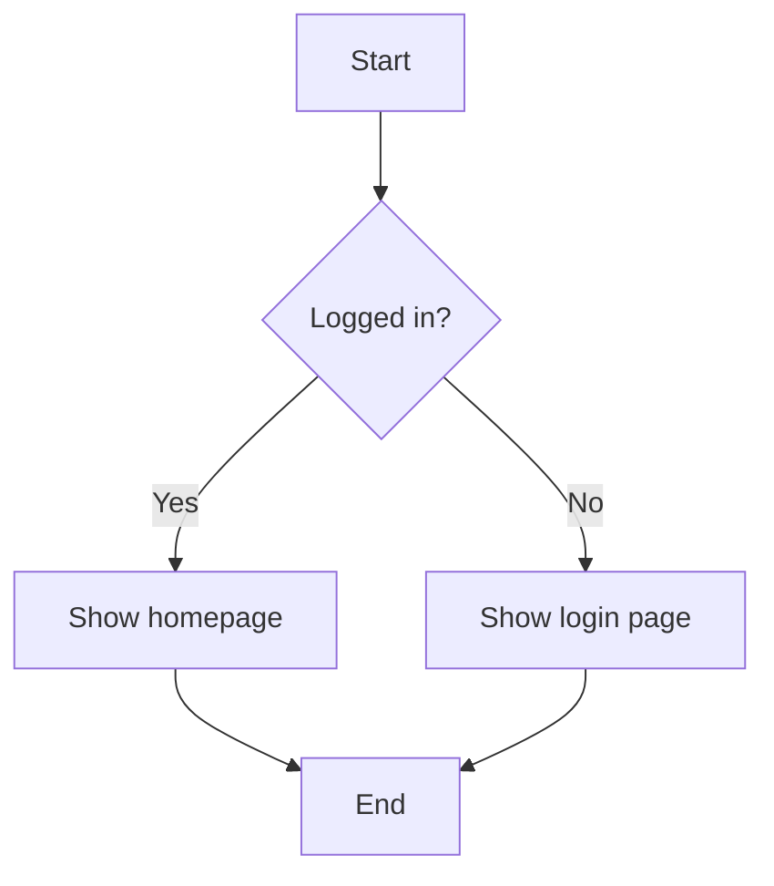
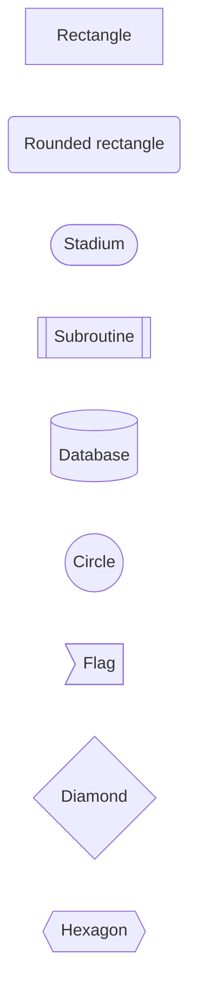
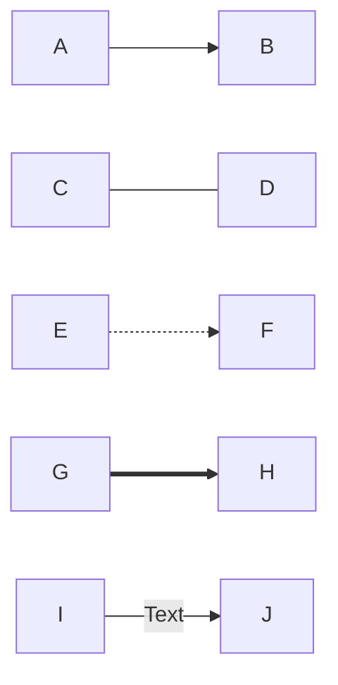
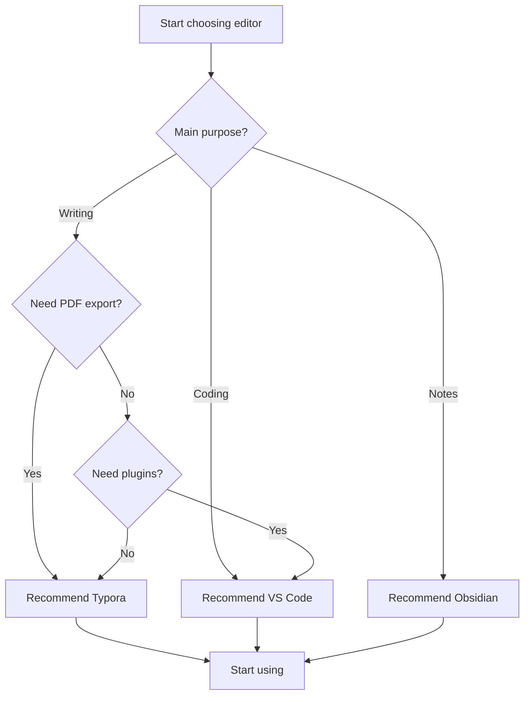
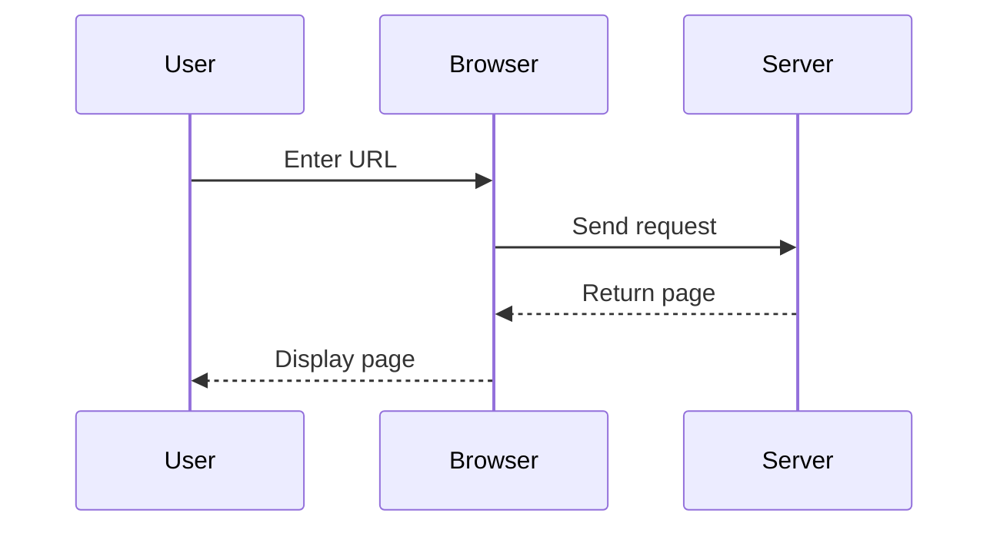
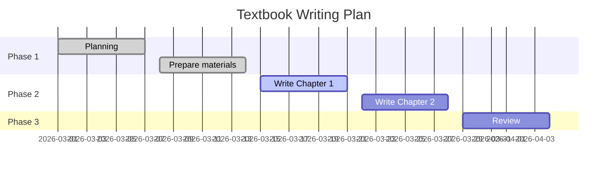
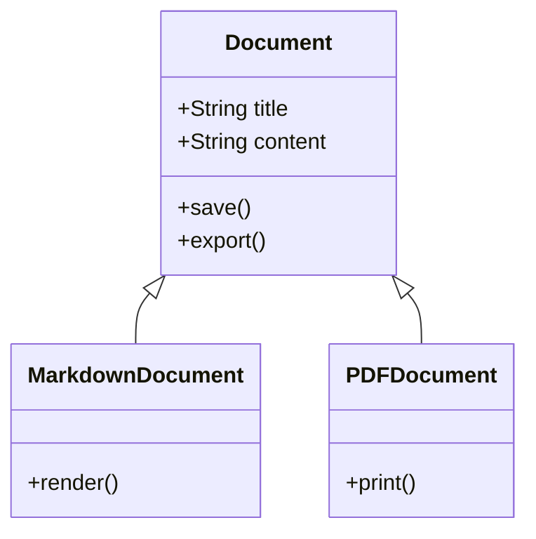

# Chapter 4: Beyond Basic Syntax — Tables, Task Lists, Diagrams, and Extended Features


## What You'll Learn in This Chapter

This chapter covers Markdown's advanced features: how to create complex tables for clearer data presentation, how to use task lists to manage to-do items, how to draw flowcharts, sequence diagrams, and other charts with Mermaid, how to use mathematical and chemical formulas in Markdown, how to use HTML to break through Markdown's limitations, and how to write documents that display correctly across different platforms.

## Why These Advanced Features Are Needed

In previous chapters, we learned Markdown's basic syntax: headings, paragraphs, lists, links, images, code blocks, etc. These basic syntax elements are sufficient for writing clear documents.

However, when starting to write more professional content, you'll find basic syntax somewhat inadequate. Writing technical documentation requires displaying complex data comparisons, and basic tables aren't enough. Project planning needs flowcharts and sequence diagrams to explain system architecture. Study notes require mathematical formulas and chemical equations. Task management needs to handle to-do items directly in documents.

This is why we need to learn Markdown's advanced features—they make documents more professional, more practical, and more powerful.

## Advanced Table Usage

### Review: Basic Table Syntax

In Chapter 3 we learned basic table syntax:

```markdown
| Column 1 | Column 2 | Column 3 |
|----------|----------|----------|
| Content 1 | Content 2 | Content 3 |
| Content 4 | Content 5 | Content 6 |
```

Result:

| Column 1 | Column 2 | Column 3 |
|----------|----------|----------|
| Content 1 | Content 2 | Content 3 |
| Content 4 | Content 5 | Content 6 |

### Alignment

Control column alignment by adding colons in the separator line:

```markdown
| Left Align | Center Align | Right Align |
|:-----------|:------------:|------------:|
| Content 1  | Content 2    | Content 3   |
| Content 4  | Content 5    | Content 6   |
```

Result:

| Left Align | Center Align | Right Align |
|:-----------|:------------:|------------:|
| Content 1  | Content 2    | Content 3   |
| Content 4  | Content 5    | Content 6   |

Alignment rules:
- `:-----` Left align (default)
- `:----:` Center align
- `-----:` Right align

Usage suggestions:
- Text content: Left align
- Numbers, prices: Right align
- Titles, status: Center align

### Quick Table Editing in Typora

Typora provides convenient table editing features:

1. Create table:
   - Type `| Column 1 | Column 2 |` then press Enter
   - Or use shortcut: `Ctrl/Cmd + T`

2. Edit table:
   - Click cell to edit directly
   - `Tab` key: Move to next cell
   - `Shift + Tab`: Move to previous cell
   - `Enter`: Insert new row below current row

3. Adjust table:
   - Right-click table → Select "Table" menu
   - Can insert/delete rows and columns
   - Can set alignment

### Using Formatting in Tables

Table cells can use most Markdown formatting:

```markdown
| Feature | Syntax | Example |
|---------|--------|---------|
| **Bold** | `**text**` | Important |
| *Italic* | `*text*` | *Emphasis* |
| `Code` | `` `code` `` | `git commit` |
| [Link](url) | `[text](url)` | [GitHub](https://github.com) |
```

Result:

| Feature | Syntax | Example |
|---------|--------|---------|
| **Bold** | `**text**` | Important |
| *Italic* | `*text*` | *Emphasis* |
| `Code` | `` `code` `` | `git commit` |
| [Link](url) | `[text](url)` | [GitHub](https://github.com) |

### Organization Tips for Complex Tables

#### Tip 1: Align Source Code with Spaces

Although Markdown doesn't require source code alignment, aligning makes it easier to read and edit:

```markdown
| Tool      | Type       | Price  |
|-----------|------------|--------|
| Typora    | Editor     | $14.99 |
| VS Code   | Editor     | Free   |
| Obsidian  | Note App   | Free   |
```

#### Tip 2: Use Table Generators

For complex tables, use online tools to generate:
- [Tables Generator](https://www.tablesgenerator.com/markdown_tables)
- Edit directly in Excel, then convert to Markdown

#### Tip 3: Split Large Tables

If a table is too large, consider splitting it into multiple smaller tables, each focusing on one topic.

### Practice: Creating a Feature Comparison Table

**Scenario**: Write an article comparing features of three Markdown editors.

```markdown
| Feature | Typora | VS Code | Obsidian |
|:--------|:------:|:-------:|:--------:|
| Live Preview | Yes | No | Yes |
| Syntax Highlighting | Yes | Yes | Yes |
| Image Management | Yes | Partial | Yes |
| Export PDF | Yes | Partial | Partial |
| Price | $14.99 | Free | Free |
| Best For | Writing | Coding | Notes |
```

Result:

| Feature | Typora | VS Code | Obsidian |
|:--------|:------:|:-------:|:--------:|
| Live Preview | Yes | No | Yes |
| Syntax Highlighting | Yes | Yes | Yes |
| Image Management | Yes | Partial | Yes |
| Export PDF | Yes | Partial | Partial |
| Price | $14.99 | Free | Free |
| Best For | Writing | Coding | Notes |


## Task Lists: Managing To-Do Items

### What Is This

Task lists are an extended syntax from GitHub Flavored Markdown (GFM), used to create checkable to-do item lists.

### Syntax

```markdown
- [ ] Incomplete task
- [x] Completed task
- [ ] Another incomplete task
```

Result:

- [ ] Incomplete task
- [x] Completed task
- [ ] Another incomplete task

Note:
- `[ ]` has a space in the middle, indicates incomplete
- `[x]` or `[X]` indicates completed
- Must be used after list items (`-` or `*`)

### Using in Typora

Typora has special support for task lists:

1. **Create task list**:
   - Type `- [ ]` then press space
   - Will automatically convert to checkable checkbox

2. **Toggle status**:
   - Click checkbox directly
   - Or use shortcut: `Ctrl/Cmd + Enter`

3. **Nested task lists**:
   - Use Tab key to indent and create subtasks

### Nested Task Lists

Can create multi-level task lists:

```markdown
- [ ] Complete project
  - [x] Requirements analysis
  - [x] Design solution
  - [ ] Development implementation
    - [x] Frontend development
    - [ ] Backend development
    - [ ] Testing
  - [ ] Deployment
```

Result:

- [ ] Complete project
  - [x] Requirements analysis
  - [x] Design solution
  - [ ] Development implementation
    - [x] Frontend development
    - [ ] Backend development
    - [ ] Testing
  - [ ] Deployment

### Practice: Managing Project Tasks with Markdown

**Scenario**: Manage tasks for a textbook writing project.

```markdown
## Textbook Writing Tasks

### Phase 1: Planning
- [x] Determine textbook topics
- [x] Create chapter outline
- [x] Prepare reference materials

### Phase 2: Writing
- [ ] Chapter 1: Introduction
  - [x] Chinese version
  - [ ] English version
- [ ] Chapter 2: Advanced
  - [ ] Chinese version
  - [ ] English version

### Phase 3: Review
- [ ] Technical review
- [ ] Language polishing
- [ ] Format unification
```

Advantages:
- Intuitive: See progress at a glance
- Flexible: Add and modify tasks anytime
- Version control: Use with Git to track task changes

## Mermaid Diagrams: Drawing with Code

### What Is This

Mermaid is a tool for describing diagrams with text. Just write a few lines of code to generate flowcharts, sequence diagrams, Gantt charts, and various other diagrams.

Why use Mermaid?
- No need for specialized drawing software
- Diagrams and documents in the same file
- Easy version control (plain text)
- Easy to modify (just change the code)

### Flowchart

Flowcharts are the most commonly used diagram type, used to show processes, decisions, steps, etc.

#### Basic Syntax

````markdown

````

Result:


#### Node Shapes

Mermaid supports multiple node shapes:

````markdown

````

Result



#### Connection Line Types

````markdown

````

Result


- `-->` Solid arrow
- `---` Solid line
- `-.->` Dotted arrow
- `==>` Thick arrow
- `-- Text -->` Arrow with text

#### Direction

- `TD` or `TB`: Top to Down/Bottom
- `BT`: Bottom to Top
- `LR`: Left to Right
- `RL`: Right to Left

### Practice: Drawing a Simple Workflow

**Scenario**: Draw a flowchart for "How to choose a Markdown editor".

````markdown

````

Result


### Sequence Diagram

Sequence diagrams show interaction order between objects, commonly used to describe system architecture, API calls, etc.

#### Basic Syntax

````markdown

````

Result


### Gantt Chart

Gantt charts show project timelines and task arrangements.

````markdown

````

Result


### Class Diagram

Class diagrams show classes and their relationships in object-oriented design.

````markdown

````

Result


### Using Mermaid in Typora

Typora natively supports Mermaid:

1. Type ` ```mermaid ` to create code block
2. Enter Mermaid code in the code block
3. Typora will automatically render it as a diagram
4. Click diagram to edit code

Tip: If diagram doesn't display, check:
- Is code block language set to `mermaid`
- Is Mermaid syntax correct
- Does Typora version support it (recommend using latest version)

## Advanced Mathematical Formulas

### Review: Basic Formula Syntax

In Chapter 3 we learned basic formula syntax:

- **Inline formula**: `$formula$`
- **Block formula**: `$$formula$$`

### Common Mathematical Symbols

#### Greek Letters

| Symbol | Code | Symbol | Code |
|--------|------|--------|------|
| α | `\alpha` | β | `\beta` |
| γ | `\gamma` | δ | `\delta` |
| θ | `\theta` | λ | `\lambda` |
| π | `\pi` | σ | `\sigma` |
| Σ | `\Sigma` | Δ | `\Delta` |

Example:

```markdown
Circle area formula: $A = \pi r^2$
```

Result: Circle area formula: $A = \pi r^2$

#### Superscripts and Subscripts

```markdown
- Superscript: $x^2$, $x^{10}$
- Subscript: $x_1$, $x_{ij}$
- Combined: $x_1^2$, $\sum_{i=1}^{n}$
```

Result:
- Superscript: $x^2$, $x^{10}$
- Subscript: $x_1$, $x_{ij}$
- Combined: $x_1^2$, $\sum_{i=1}^{n}$

#### Fractions

```markdown
- Inline fraction: $\frac{1}{2}$
- Block fraction: $$\frac{a+b}{c+d}$$
```

Result:
- Inline fraction: $\frac{1}{2}$
- Block fraction:

$$\frac{a+b}{c+d}$$

#### Roots

```markdown
- Square root: $\sqrt{2}$
- nth root: $\sqrt[n]{x}$
```

Result:
- Square root: $\sqrt{2}$
- nth root: $\sqrt[n]{x}$

#### Summation, Integration

```markdown
- Summation: $\sum_{i=1}^{n} x_i$
- Integration: $\int_{a}^{b} f(x) dx$
- Limit: $\lim_{x \to \infty} f(x)$
```

Result:
- Summation: $\sum_{i=1}^{n} x_i$
- Integration: $\int_{a}^{b} f(x) dx$
- Limit: $\lim_{x \to \infty} f(x)$

### Matrices and Equation Systems

#### Matrices

```markdown
$$
\begin{matrix}
a & b \\
c & d
\end{matrix}
$$
```

Result

$$
\begin{matrix}
a & b \\
c & d
\end{matrix}
$$

Matrices with brackets:

```markdown
$$
\begin{pmatrix}
a & b \\
c & d
\end{pmatrix}
$$
```

Result

$$
\begin{pmatrix}
a & b \\
c & d
\end{pmatrix}
$$

#### Equation Systems

```markdown
$$
\begin{cases}
x + y = 5 \\
2x - y = 1
\end{cases}
$$
```

Result

$$
\begin{cases}
x + y = 5 \\
2x - y = 1
\end{cases}
$$

### Chemical Formulas (mhchem Extension)

Typora supports the mhchem extension for writing chemical equations:

```markdown
$$\ce{H2O}$$
$$\ce{CO2 + H2O -> H2CO3}$$
$$\ce{2H2 + O2 -> 2H2O}$$
```

Result:
- Water: $\ce{H2O}$
- Photosynthesis: $\ce{CO2 + H2O -> H2CO3}$
- Combustion: $\ce{2H2 + O2 -> 2H2O}$

### Practice: Writing a Technical Document with Formulas

**Scenario**: Write a document about "Quadratic equation root formula".

```markdown
## Quadratic Equation Root Formula

For a general quadratic equation:

$$ax^2 + bx + c = 0 \quad (a \neq 0)$$

Its solution is:

$$x = \frac{-b \pm \sqrt{b^2 - 4ac}}{2a}$$

Where:
- $a, b, c$ are equation coefficients
- $\Delta = b^2 - 4ac$ is called the discriminant

Based on the discriminant value, we can determine the nature of equation roots:
- When $\Delta > 0$, equation has two distinct real roots
- When $\Delta = 0$, equation has two equal real roots
- When $\Delta < 0$, equation has no real roots
```

## HTML Embedding: Breaking Through Markdown Limitations

### When HTML Is Needed

Markdown's design philosophy is "simple enough", but sometimes you need features Markdown doesn't support:

- Collapsible content (details tag)
- Keyboard key styling (kbd tag)
- Highlighted text (mark tag)
- Embedded video, audio
- More complex layouts

In these cases, you can use HTML directly in Markdown.

### Common HTML Tags

#### `<details>` and `<summary>`: Collapsible Content

```html
<details>
<summary>Click to expand details</summary>

This is collapsed content, only shown after clicking "expand".

Can contain any Markdown content:
- Lists
- **Bold**
- `Code`

</details>
```

Result:

<details>
<summary>Click to expand details</summary>

This is collapsed content, only shown after clicking "expand".

Can contain any Markdown content:
- Lists
- **Bold**
- `Code`

</details>

Use cases:
- FAQ (Frequently Asked Questions)
- Long supplementary explanations
- Optional reading content

#### `<kbd>`: Keyboard Keys

```html
Press <kbd>Ctrl</kbd> + <kbd>C</kbd> to copy
Press <kbd>Ctrl</kbd> + <kbd>V</kbd> to paste
```

Result:

Press <kbd>Ctrl</kbd> + <kbd>C</kbd> to copy
Press <kbd>Ctrl</kbd> + <kbd>V</kbd> to paste

#### `<mark>`: Highlighted Text

```html
This is normal text, <mark>this part is highlighted</mark>.
```

Result:

This is normal text, <mark>this part is highlighted</mark>.

#### Embedded Video

```html
<video width="640" height="360" controls>
  <source src="video.mp4" type="video/mp4">
  Your browser does not support the video tag.
</video>
```

#### Embedded Audio

```html
<audio controls>
  <source src="audio.mp3" type="audio/mpeg">
  Your browser does not support the audio tag.
</audio>
```

### Note: Compatibility Issues

Important: Not all platforms support all HTML tags.

- **Typora**: Supports most HTML tags
- **GitHub**: Supports some HTML tags (for security reasons)
  - Supported: `<details>`, `<summary>`, `<kbd>`, `<sub>`, `<sup>`
  - Not supported: `<script>`, `<style>`, `<iframe>`, etc.
- **Other platforms**: Support varies

**Suggestions**:
- If document will be displayed on multiple platforms, use HTML sparingly
- Test whether target platform supports it before using
- Provide alternatives for unsupported platforms

## Platform Compatibility Reminders

### What GitHub Supports and Doesn't Support

GitHub uses GitHub Flavored Markdown (GFM), which supports:

Supported features:
- Basic Markdown syntax
- Tables
- Task lists
- Strikethrough (`~~text~~`)
- Auto-linking (directly writing URL will auto-convert to link)
- Emoji (``:smile:`` → smile emoji)
- Some HTML tags

**Unsupported or limited support features**:
- Mermaid diagrams (GitHub recently started supporting, but rendering may differ)
- Mathematical formulas (need to use images or other methods)
- Most HTML tags (for security reasons)
- Custom CSS

### Typora vs GitHub Differences

| Feature | Typora | GitHub |
|---------|--------|--------|
| Basic syntax | Yes | Yes |
| Tables | Yes | Yes |
| Task lists | Yes | Yes |
| Mermaid | Yes | Partial |
| Math formulas | Yes | No |
| HTML | Yes | Partial |
| Custom themes | Yes | No |

### How to Write Documents with Good Compatibility

#### Principle 1: Prioritize Standard Markdown Syntax

Standard Markdown syntax displays correctly on all platforms.

#### Principle 2: Test Target Platform

If your document will be displayed on GitHub, preview it on GitHub after writing.

#### Principle 3: Provide Alternatives

If using features some platforms don't support, provide alternatives:

```markdown
<!-- Mermaid flowchart (GitHub may not support) -->


<!-- If diagram above doesn't display, see: [Flowchart image](flowchart.png) -->
```

#### Principle 4: Use Images as Fallback

For complex diagrams and formulas, can export as images:

```markdown
<!-- Mathematical formula -->
$$E = mc^2$$

<!-- If formula doesn't display, see:  -->
```

## Common Problems and Solutions

### Problem 1: Mermaid Diagrams Don't Display on GitHub

**Solution**:
1. Confirm whether GitHub supports Mermaid (recently started supporting)
2. If not supported, export as image:
   - In Typora right-click diagram → Export as image
   - Replace Mermaid code with image

### Problem 2: Mathematical Formulas Don't Display on GitHub

**Solution**:
1. Use images: Export formula as image
2. Use online formula rendering service (like CodeCogs)
3. Use GitHub's LaTeX rendering (supported in issues and PRs)

### Problem 3: Tables Display Inconsistently in Typora and GitHub

**Solution**:
- Check if alignment syntax is correct
- Avoid overly complex formatting in tables
- Preview on GitHub to confirm

### Problem 4: Task Lists Can't Be Checked

**Solution**:
- In Typora: Click checkbox directly
- In GitHub: Need to edit file to modify
- In other editors: Manually change `[ ]` to `[x]`

## Chapter Summary

In this chapter, we learned Markdown's advanced features.

For advanced tables, we learned alignment (left, center, right), how to quickly edit tables in Typora, how to use formatting in tables, and organization tips for complex tables.

For task lists, we learned the syntax `- [ ]` and `- [x]`, how to click to toggle status in Typora, how to create nested task lists, and how to manage project tasks with Markdown.

For Mermaid diagrams, we learned flowcharts (showing processes and decisions), sequence diagrams (showing object interactions), Gantt charts (showing project timelines), and class diagrams (showing object-oriented design).

For advanced mathematical formulas, we learned common mathematical symbols, matrices and equation systems, and chemical formulas (mhchem).

For HTML embedding, we learned `<details>` and `<summary>` (collapsible content), `<kbd>` (keyboard keys), `<mark>` (highlighted text), and how to embed video and audio.

For platform compatibility, we learned features GitHub supports and doesn't support, Typora vs GitHub differences, and how to write documents with good compatibility.

## Next Steps

Now you've mastered Markdown's advanced features and can write more professional, more powerful documents.

However, after writing documents, you still need to:
- Export as PDF or HTML
- Publish to websites
- Ensure correct display on different platforms

In the next chapter, we'll learn **Export, Publishing, and Platform Compatibility**:
- How to export professional PDFs with Typora
- How to use YAML Front Matter to manage document metadata
- How to optimize GitHub display
- How to publish to GitHub Pages
