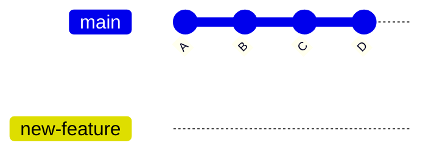
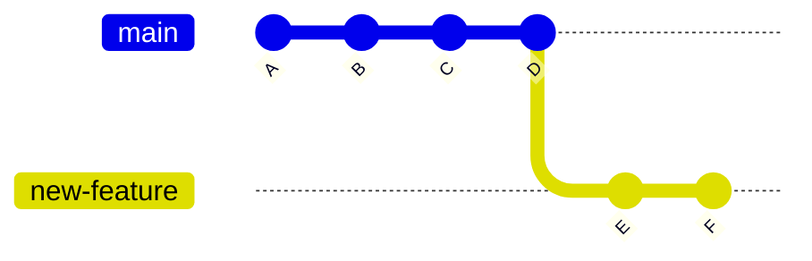
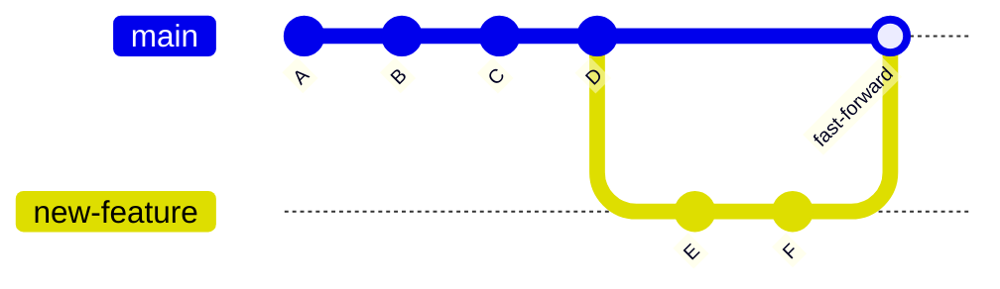
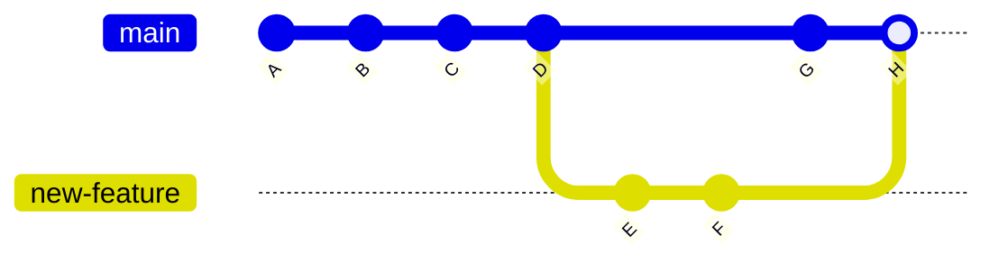

# 第四章：分支——同时做多件事

## 本章你会学到什么

- 理解分支是什么，为什么它如此重要
- 创建、切换、重命名和删除分支
- 合并分支以及解决合并冲突
- 用 `git stash` 暂存未完成的工作

## 一条直线不够用的时候

假设你正在写一篇文档，第四章的草稿已经写了一半。这时编辑发来消息："第一章有个错别字，明天 PDF 就要付印了，赶紧改。"

没有分支的话，你面临一个难题：工作区里全是第四章的未完成修改。你可以先提交当前的修改，再去改错别字，然后回到第四章继续写。但这样就把两件互不相关的事情混进了同一条时间线。万一改错别字的时候引入了新问题，你很难单独撤回——因为第四章的修改也夹在里面。

有了分支，解决方案很干净：创建一个新分支，在上面改错别字，提交，合并回来。你的第四章草稿从头到尾没被动过。

这就是分支的核心思想——让 Git 在同一个仓库里同时维护多条独立的工作线。每条分支都是一个独立的工作空间，一条分支上的修改不会影响其他分支，直到你决定把它们合到一起。

## 分支到底是什么

在 Git 里，分支只是一个可移动的指针，指向某个提交。就这些。它不是文件的副本，不是文件夹，不是什么重的东西。它只是一个轻量级的标签——41 字节的数据——告诉 Git"这条开发线的最新提交在这里"。

当你创建新仓库并做出第一次提交时，Git 会自动创建一个叫 `main` 的分支（旧版本叫 `master`）。这个指针每次你做出新提交时就往前移一步。



两个分支指向同一个提交。但当你开始在 `new-feature` 上做出新提交后，两个指针就分叉了：



`main` 仍然指向 D，而 `new-feature` 已经移到了 F。从 A 到 D 的提交是共享的——它们存在于两条分支的历史中。只有 E 和 F 是 `new-feature` 独有的。

这就是为什么在 Git 中创建分支几乎是瞬间完成的，成本几乎为零。你并没有复制文件，只是添加了一个标签。

## 创建和切换分支

### 创建分支

```bash
$ git branch new-feature
```

这会基于当前提交创建一个叫 `new-feature` 的新分支。你的工作区不会变化——你仍然在原来的分支上。确认当前在哪个分支：

```bash
$ git branch
* main
  new-feature
```

`*` 标记当前分支。`new-feature` 已经存在，但你还没有切换过去。

### 切换到分支

```bash
$ git checkout new-feature
```

或者用更新的、推荐的命令：

```bash
$ git switch new-feature
```

现在你的工作区反映的是 `new-feature` 的状态。你接下来做的修改和提交都会推进这条分支，而不是 `main`。

```bash
$ git branch
  main
* new-feature
```

`*` 移到了 `new-feature`。你现在在这条分支上。

### 一步完成创建和切换

大多数时候，你想创建分支的同时立刻切过去：

```bash
$ git checkout -b new-feature
```

或者：

```bash
$ git switch -c new-feature
```

两个命令做同样的事：创建分支并切换过去。这是最常用的用法——想到一个新任务，为它创建分支，然后开始干。

### 一个完整的例子

下面是一个典型的分支工作流，从头到尾：

```bash
# 1. 查看当前状态
$ git status
On branch main
nothing to commit, working tree clean

# 2. 创建并切换到新分支
$ git switch -c fix-typo-in-ch1

# 3. 做你的修改
# （编辑 chapter-01.md）

# 4. 提交
$ git add chapter-01.md
$ git commit -m "fix: correct typo in chapter 1 heading"

# 5. 切回 main
$ git switch main

# 6. 你的第四章草稿还在
# （它从来没被动过）
```

### 重命名分支

如果分支的名字不再合适：

```bash
# 重命名当前分支
$ git branch -m better-name

# 重命名其他分支
$ git branch -m old-name better-name
```

### 删除分支

合并完成后，不再需要的分支应该删掉，保持整洁：

```bash
$ git branch -d fix-typo-in-ch1
```

Git 会拒绝删除还没合并的分支（防止你丢失工作）。如果你确定要强行删除：

```bash
$ git branch -D fix-typo-in-ch1
```

大写的 `-D` 强制删除。只有在你确定这个分支的工作不再需要时才用。

## 查看分支

你已经见过 `git branch` 列出本地分支。以下是几个实用的变体：

```bash
# 列出所有分支（本地和远程）
$ git branch -a

# 列出分支及其最后一次提交的信息
$ git branch -v

# 列出已经合并到当前分支的分支
$ git branch --merged

# 列出还没合并的分支
$ git branch --no-merged
```

`--merged` 特别适合用来做清理：它告诉你哪些分支可以安全删除，因为它们的工作已经被合并了。

## 合并分支

你在 `new-feature` 上工作了一阵，做了几个提交，现在对结果很满意。是时候把这些改动合并到 `main` 了。

### 基本合并

```bash
# 1. 切换到你想要合并到的目标分支
$ git switch main

# 2. 把另一条分支合并进来
$ git merge new-feature
```

Git 执行**快进合并（fast-forward merge）**——当被合并的分支（这里是 `new-feature`）只是领先于目标分支（`main`）时，Git 只需把 `main` 指针往前移：



历史是一条直线。没有创建任何特殊提交——`main` 只是追上了 `new-feature` 的位置。

### 快进合并不适用的情况

如果在你创建分支之后 `main` 又有了新的提交，快进就不再可能。Git 必须创建一个**合并提交（merge commit）**来把两条历史线合在一起：



Git 会打开编辑器让你写合并提交信息。默认信息通常就够了：

```
Merge branch 'new-feature'
```

你可以补充更多上下文，也可以直接保存退出。

### 合并冲突

合并冲突发生在同一个文件的同一个位置，在两条分支上都被修改了。Git 无法自动判断保留哪个版本，所以停下来让你来决定。

假设两条分支都改了 `chapter-04.md` 的第 10 行：

```bash
$ git merge new-feature
Auto-merging chapter-04.md
CONFLICT (content): Merge conflict in chapter-04.md
Automatic merge failed; fix conflicts and then commit the result.
```

Git 会在文件中标记冲突的部分：

```markdown
# 第四章

<<<<<<< new-feature
这是 new-feature 分支上的版本。
=======
这是 main 分支上的版本。
>>>>>>> main
```

标记的含义很直观：

- `<<<<<<< new-feature` — 冲突开始，这部分来自 `new-feature`
- `=======` — 两个版本的分隔线
- `>>>>>>> main` — 冲突结束，这部分来自 `main`

解决冲突的方法：编辑文件，选择其中一个版本，或者把两个版本组合起来，或者写一个全新的版本。然后删除所有冲突标记：

```markdown
# 第四章

这是合并后的最终版本，综合了两个分支的优点。
```

解决完之后，暂存并提交：

```bash
# 1. 标记冲突已解决
$ git add chapter-04.md

# 2. 完成合并
$ git commit
```

Git 知道这是一个合并提交，所以会使用默认的合并信息。你可以按需修改。

### 取消合并

如果你开始了合并，但发现太乱或者还没准备好：

```bash
$ git merge --abort
```

这会取消合并，让你回到运行 `git merge` 之前的状态。你的工作区和暂存区都会恢复原样。

## Git Stash：不提交也能保存工作

有时候你在一条分支上做到一半，需要切到另一条分支处理紧急事情。但当前的修改还没完成，不适合提交——它们是半成品。

`git stash` 让你把未提交的修改临时保存起来，切换分支去做别的事，然后回来接着干。

### 保存工作

```bash
# 保存当前修改
$ git stash
Saved working directory and index state WIP on main: 61b6377 docs: add chapter 3
```

你的工作区现在是干净的——可以自由切换分支了。

### 带消息保存

如果你有多个 stash，加个消息方便以后识别：

```bash
$ git stash push -m "第四章写到一半的草稿"
```

### 查看 stash 列表

```bash
$ git stash list
stash@{0}: On main: 第四章写到一半的草稿
stash@{1}: On main: WIP saved before switching to fix typo
```

### 恢复工作

```bash
# 恢复最近的 stash（保留在列表中）
$ git stash apply

# 恢复指定的 stash
$ git stash apply stash@{1}

# 恢复并从列表中移除
$ git stash pop
```

`apply` 保留 stash，让你以后还能再用。`pop` 恢复并移除。大多数时候用 `pop` 就好——工作恢复了，stash 就不需要了。

### Stash 与分支无关

一个重要的细节：`git stash` 保存的是实际的文件修改，不是某个分支的快照。你可以在不同的分支上应用 stash。如果你在错误的分支上开始了工作——直接 stash，切换到正确的分支，然后 pop。

## 实战工作流：功能分支

下面是一个把分支、合并和 stash 串联起来的真实场景。假设你在维护一个教材项目：

```bash
# 1. 从 main 开始，确保是最新的
$ git switch main
$ git pull

# 2. 为新章节创建分支
$ git switch -c write-chapter-5

# 3. 写了一阵，做了几个提交
# （编辑、add、commit，反复...）

# 4. 突然 main 上有紧急错别字要改
$ git stash                      # 保存半成品
$ git switch main                # 切到 main
$ git switch -c fix-urgent-typo  # 为修复创建分支

# （编辑错别字、add、commit）

# 5. 把修复合并到 main
$ git switch main
$ git merge fix-urgent-typo

# 6. 回到你的章节工作
$ git switch write-chapter-5
$ git stash pop                 # 恢复半成品

# 7. 继续写，完成章节
# （编辑、add、commit...）

# 8. 把章节合并到 main
$ git switch main
$ git merge write-chapter-5

# 9. 清理已合并的分支
$ git branch -d fix-urgent-typo
$ git branch -d write-chapter-5
```

这个工作流有几个好处：

- 错别字修复和新章节完全隔离
- 每个改动都有自己清晰的提交历史
- 一个任务出问题不会影响另一个
- main 分支始终稳定——新工作只通过明确的合并进入

## 分支命名规范

好的分支名让你和协作者一眼就能看出这条分支是做什么的。常见的命名模式：

- `fix/描述` — 修复 bug，例如 `fix/typo-in-ch1`、`fix/wrong-formula`
- `feature/描述` — 新功能或新内容，例如 `feature/chapter-5`、`feature/add-exercises`
- `docs/描述` — 文档修改，例如 `docs/update-readme`
- `experiment/描述` — 实验性或有风险的工作，例如 `experiment/new-layout`

模式是：`类型/简短描述`。全部小写，用连字符代替空格，描述要具体到一周后你还能看懂。

## 常见问题与解决

**问题1：我在** **`main`** **上做了修改，但应该在新建的分支上做。**

直接从当前状态创建新分支——Git 会把未提交的修改一起带过去：

```bash
$ git switch -c new-feature
```

如果已经提交了：

```bash
$ git branch new-feature       # 在当前提交上创建分支
$ git reset --mixed HEAD~1     # 撤销 main 上的提交（保留修改）
```

**问题2：我在错误的分支上提交了。**

把提交移到正确的分支：

```bash
# 先创建正确的分支
$ git branch correct-branch
# 把 main 往回退一个提交
$ git switch main
$ git reset --mixed HEAD~1
# 切到正确的分支——你的提交在那里
$ git switch correct-branch
```

**问题3：合并冲突看起来太复杂了。**

别慌。用 `git diff` 看清楚到底改了什么：

```bash
$ git diff
```

一个冲突区域一个冲突区域地处理。如果实在太复杂，先取消合并，准备好了再来：

```bash
$ git merge --abort
```

**问题4：我不小心删除了分支。**

用 `git reflog` 恢复：

```bash
# 找到那个分支曾经指向的提交
$ git reflog
# 找到你在那条分支上工作时的提交
# 然后重新创建分支
$ git branch recovered-branch <提交ID>
```

**问题5：`git stash pop`** **时出现了冲突。**

这是因为 stash 里的修改和你当前分支的状态有冲突。像处理合并冲突一样解决，然后提交：

```bash
$ git add <冲突文件>
$ git commit
```

## 本章小结

分支是 Git 最强大的功能之一。分支只是一个指向提交的轻量指针——创建几乎不花成本，切换是瞬间的。

核心的分支工作流是：为每个任务创建分支，在上面提交，然后合并回 `main`。`git switch -c 分支名` 创建并切换，`git switch main` 切回去，`git merge 分支名` 把工作合到一起。

当两条分支修改了同一个文件的同一个位置时，会产生合并冲突。Git 用 `<<<<<<<`、`=======` 和 `>>>>>>>` 标记冲突区域。你通过编辑文件选择或组合版本，然后暂存并提交来完成解决。

`git stash` 让你临时保存未提交的工作，切换分支去做别的事，然后回来继续。`git stash push -m "消息"` 带标签保存，`git stash pop` 恢复并移除 stash。

好的分支名遵循 `类型/描述` 的模式，让人一眼看出分支的用途。

## 下一步

你现在知道了如何用分支在同一个仓库里管理多条工作线。但到目前为止，所有操作都在你自己的电脑上。下一章会把你的本地工作连接到更广阔的世界：远程仓库。你会学到 `git remote`、`git fetch`、`git pull`、`git push`，以及本地分支和远程跟踪分支之间的关系。这是之后一切内容——协作、代码审查、GitHub 工作流——的基础。
