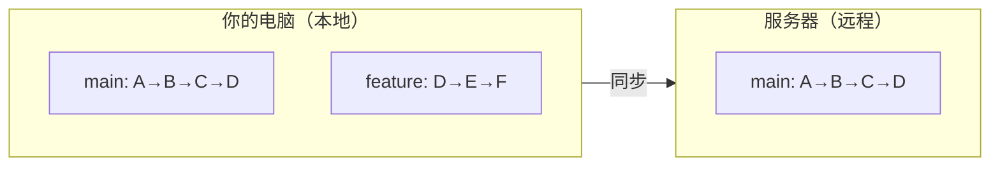
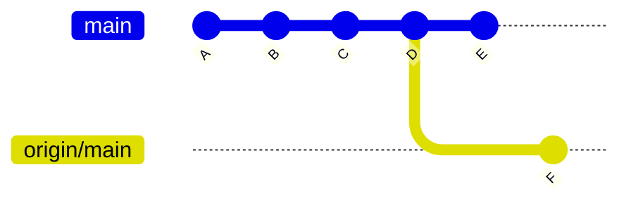

# 第五章：远程仓库——把你的工作连接到世界

## 本章你会学到什么

- 理解远程仓库是什么，以及它和你本地仓库的关系
- 用 `git remote` 添加、查看和移除远程连接
- 用 `git fetch` 和 `git pull` 下载远程的修改
- 用 `git push` 上传本地的修改
- 理解本地分支和远程跟踪分支之间的关系

## 你的工作一直是一座孤岛

到目前为止，你所做的一切——提交、分支、合并、stash——都只存在于你自己的电脑上。你的仓库是本地的。如果硬盘坏了，所有历史就没了。如果你想和别人协作，没有办法分享你的工作。如果你在笔记本和台式机之间切换，一台机器上的修改在另一台根本不存在。

远程仓库解决了所有这些问题。它是你的仓库的一个副本，存放在服务器上——最常见的是 GitHub、GitLab 或 Bitbucket。你的本地仓库和远程仓库可以交换修改：你上传你的提交，下载别人的提交，让两份副本保持同步。

它们的关系很简单：你有一个本地仓库，服务器上有一份副本。它们通过几条特定的命令互相通信。这就是全貌。

## 本地和远程：心智模型

把你的本地仓库和远程仓库想象成同一个项目的两份独立副本。每一份都有自己的分支、自己的提交历史。它们可以分叉——你可能有一些远程没有的提交，远程也可能有一些你没有的提交。

关键在于：两份副本没有谁是"正宗的"。它们是平等的。Git 不会把远程当作比你本地仓库更权威的东西。远程只是恰好存放在服务器上的另一份副本而已。

基本的流程是这样的：



现在本地 `main` 和远程 `main` 在同一个位置（D）。但你有一个本地的 `feature` 分支，里面有提交 E 和 F，远程还不知道它们。你可以把这个分支推送到远程来分享。如果别人在远程上添加了提交，你可以拉取到本地。

这就是基本模型。本章剩下的一切都是关于如何建立和管理这种关系的细节。

## 设置远程：`git remote`

### 添加远程

当你从 GitHub 克隆一个仓库时，远程是自动配置好的。但如果你先创建了本地仓库，现在想连接到一个远程，就需要手动添加：

```bash
$ git remote add origin https://github.com/yourname/your-repo.git
```

拆开来看：

- `git remote add` — 注册新远程的命令
- `origin` — 这个远程的简称（相当于昵称）
- URL — 远程仓库的地址

`origin` 这个名字是约定俗成的，不是强制的。按照惯例，`origin` 指的是主要远程——你克隆下来的那个，或者你认为的"大本营"。你可以给它取任何名字，但偏离 `origin` 会让你未来的自己和协作者感到困惑。

远程 URL 有两种形式：

- **HTTPS**：`https://github.com/yourname/your-repo.git` — 任何地方都能用，用个人访问令牌或密码认证
- **SSH**：`git@github.com:yourname/your-repo.git` — 用 SSH 密钥认证，配置好之后不需要输密码

两种都行。HTTPS 入门更简单，SSH 配置好之后使用更方便。

### 查看远程

```bash
# 列出所有远程
$ git remote
origin

# 查看远程的 URL
$ git remote -v
origin  https://github.com/yourname/your-repo.git (fetch)
origin  https://github.com/yourname/your-repo.git (push)
```

每个远程有两个 URL：一个用于 fetch（下载），一个用于 push（上传）。通常它们是同一个，但在高级配置中可以不同。

### 重命名和移除远程

```bash
# 重命名远程
$ git remote rename origin upstream

# 移除远程
$ git remote remove origin
```

重命名在你 fork 了别人的仓库时很有用——把原来的仓库叫 `upstream`，把你自己的 fork 叫 `origin`。移除在清理旧连接时有用。

## 克隆：另一种获得远程的方式

如果远程仓库已经存在，你可以直接克隆，而不是手动创建本地仓库再添加远程：

```bash
$ git clone https://github.com/yourname/your-repo.git
```

这个命令一次性做了好几件事：

- 创建一个以仓库名命名的新目录
- 在里面初始化一个本地 Git 仓库
- 把远程注册为 `origin`
- 下载所有历史
- 检出默认分支（通常是 `main`）

克隆完成后你就可以开始工作了。远程已经配置好，本地历史和远程一致。

你可以指定克隆后的目录名：

```bash
$ git clone https://github.com/yourname/your-repo.git my-custom-name
```

或者只克隆特定分支：

```bash
$ git clone --branch develop https://github.com/yourname/your-repo.git
```

## 下载修改：`git fetch` 和 `git pull`

### `git fetch`：只下载，不合并

`git fetch` 从远程下载新的提交和分支，但不会修改你的本地分支。它是查看远程有什么新内容的最安全方式。

```bash
$ git fetch origin
```

这会下载 `origin` 上所有你还没有的东西——新提交、新分支、新标签——然后把它们存在本地。Git 把这些叫做"远程跟踪分支"。稍后详细解释。

下载完之后，你可以查看有什么变化：

```bash
# 看远程多了哪些提交
$ git log HEAD..origin/main --oneline

# 看文件具体改了什么
$ git diff HEAD..origin/main
```

这些命令比较你当前的 `main` 和远程的 `main`，但不碰你的工作区。

`git fetch` 是"先看看再决定"的命令。它让你在把远程修改合并进你的工作之前，先审查一遍。

### `git pull`：下载并合并，一步到位

`git pull` 本质上是 `git fetch` 加上 `git merge`。它下载修改，然后立刻合并到你当前的分支。

```bash
$ git pull origin main
```

这等价于：

```bash
$ git fetch origin
$ git merge origin/main
```

`git pull` 在你确定要立刻合并时很方便——比如你在 `main` 上，只是想更新到最新版本。但它不如 `fetch` 安全，因为它立刻改变了你的本地状态。如果有冲突，你必须马上处理。

### Fetch vs Pull：什么时候用哪个

| 场景 | 用什么 |
|------|--------|
| 想先审查修改再决定是否合并 | `git fetch` |
| 在团队协作中想看看别人做了什么 | `git fetch` |
| 在 `main` 上，只想快速更新 | `git pull` |
| 确定不会有冲突 | `git pull` |
| 想对进入你分支的内容有最大控制力 | `git fetch` |

一个好习惯是默认用 `git fetch`，审查完变化后再决定是否合并。这让你有时间在远程修改影响你的工作之前，先理解它们是什么。

## 上传修改：`git push`

### 基本推送

在本地做了提交之后，用 `git push` 发送到远程：

```bash
$ git push origin main
```

这会把你本地 `main` 分支的提交上传到远程的 `main` 分支。推送之后，两份副本就同步了。

### 第一次推送新分支

当你创建了新的本地分支并想第一次推送时，需要告诉 Git 这个本地分支应该跟踪哪个远程分支：

```bash
$ git push -u origin new-feature
```

`-u`（或 `--set-upstream`）做两件事：把分支推送到远程，并且设置跟踪关系，让以后的 push 和 pull 知道该用哪个远程分支。第一次用 `-u` 推送之后，以后只需要：

```bash
$ git push
```

不用再指定远程和分支名——Git 记住了跟踪关系。

### 如果远程有新提交怎么办

如果别人在你工作的同时往远程推送了修改，你的 push 会被拒绝：

```bash
$ git push origin main
To https://github.com/yourname/your-repo.git
 ! [rejected]        main -> main (fetch first)
error: failed to push some refs to 'github.com:yourname/your-repo.git'
hint: Updates were rejected because the remote contains work that you do
hint: not have locally. This is usually caused by another repository pushing
hint: to the same ref.
```

这是 Git 在保护你。如果你强行推送，会覆盖别人的工作。正确做法是先 pull 来整合他们的修改，解决冲突后再 push：

```bash
$ git pull origin main
# 如果有冲突，先解决
$ git push origin main
```

### 强制推送：极其谨慎地使用

你可以强制推送来覆盖远程的历史：

```bash
$ git push --force origin main
```

这会用你的本地历史替换远程的历史。远程上你本地没有的提交会永久丢失，其他协作者的工作也会被打乱。

**警告**：绝对不要在共享分支（比如 `main`）上强制推送。这只适合你自己的个人分支，没有别人在上面工作的情况。如果有多个人用这条分支，强制推送会搞坏他们的仓库。

一个稍微安全一点的替代方案是 `--force-with-lease`：

```bash
$ git push --force-with-lease origin main
```

它会检查远程在你上次 fetch 之后有没有被更新。如果有，推送会被拒绝。这能防止你意外覆盖别人的工作，同时在你确定安全的情况下仍然允许你改写历史。

## 远程跟踪分支

在你运行 `git fetch` 或 `git clone` 之后，Git 会创建一种特殊的分支，叫做远程跟踪分支。这是 Git 在本地记录远程状态的方式。

远程跟踪分支存在于你的仓库中，但你不能直接编辑它们。它们是远程状态的只读镜像。命名规则是：

```
<远程名>/<分支名>
```

比如，从 `origin` fetch 之后，你会看到：

```bash
$ git branch -a
* main
  new-feature
  remotes/origin/main
  remotes/origin/new-feature
  remotes/origin/develop
```

`remotes/origin/` 下面的就是远程跟踪分支。它们反映的是你上次 fetch 时远程的状态。它们只在 `git fetch` 时才会更新——不会自动更新。

当你运行 `git merge origin/main` 时，你是在把远程跟踪分支 `origin/main` 合并到你的本地 `main`。当你运行 `git push origin main` 时，你是在把本地 `main` 发送到远程去更新远程的 `main`（下次 fetch 时，`origin/main` 也会更新）。

这个区别很重要。`origin/main` 和 `main` 不是同一个东西。`origin/main` 是你的本地仓库对远程状态的记录。`main` 是你真正在上面工作的本地分支。它们可以指向不同的提交，而且经常如此——这正是远程有新提交你还没 pull 时的状态。



你有提交 E，远程还没有。远程有提交 F，你还没有。运行 `git pull` 会把 F 合并到你的 `main`，产生一个合并提交 G。

## 完整的同步工作流

下面是一个把 fetch、pull、push 和远程跟踪分支串联起来的完整工作流：

```bash
# 1. 先 fetch 看看远程有什么新东西
$ git fetch origin

# 2. 查看远程改了什么
$ git log HEAD..origin/main --oneline

# 3. 如果要整合这些修改
$ git pull origin main
# （如果有冲突，先解决）

# 4. 做你的工作
# （编辑文件、add、commit...）

# 5. 推送你的修改
$ git push origin main
```

对于个人项目的日常工作，`git pull` → 工作 → `git push` 是标准节奏。对于团队协作，养成先 `git fetch` 的习惯——在远程修改到来之前先看到它们——是值得培养的纪律。

## 常见问题与解决

**问题1："fatal: 'origin' does not appear to be a git repository"**

你想 push 或 pull，但没有配置远程。添加一个：

```bash
$ git remote add origin https://github.com/yourname/your-repo.git
```

**问题2：push 被拒绝，因为远程有新提交。**

先 pull 再 push：

```bash
$ git pull origin main
$ git push origin main
```

如果 pull 产生了冲突，先解决（编辑冲突文件、`git add`、`git commit`），再 push。

**问题3：我不小心在** **`main`** **上提交了，应该在新建的分支上做。**

把提交移到新分支，然后重置 `main`：

```bash
$ git branch new-feature          # 在当前提交上创建分支
$ git reset --hard HEAD~1         # 把 main 往回退
$ git switch new-feature          # 切到有你的提交的分支
```

然后推送新分支：

```bash
$ git push -u origin new-feature
```

**问题4：我想撤销一次 push。**

如果 push 发生不久，而且没有人在此基础上继续工作：

```bash
$ git reset --hard HEAD~1
$ git push --force-with-lease origin main
```

如果别人已经 pull 了你的修改，不要强制推送。用 `git revert` 代替：

```bash
$ git revert <提交ID>
$ git push origin main
```

**问题5："error: failed to push some refs"，别人也在往同一条分支上推送。**

这是正常情况。说明远程在你上次 fetch 之后有了新提交。先 pull 整合，再 push：

```bash
$ git pull --rebase origin main
$ git push origin main
```

`--rebase` 会把你的提交重放到远程提交之上，通常比产生一个合并提交的历史更干净。rebase 会在后面的章节详细讲解。

## 本章小结

远程仓库是你的仓库存放在服务器上的副本，实现备份、分享和协作。最常见的托管平台是 GitHub、GitLab 和 Bitbucket。

`git remote add origin <url>` 把本地仓库连接到远程。`git clone <url>` 从已有的远程仓库创建本地副本，包含完整历史和远程配置。

`git fetch` 下载远程修改但不改变本地分支——这是安全审查新内容的方式。`git pull` 一步完成下载和合并——在你只想快速更新时很方便。协作时默认用 `fetch`，确定没有冲突时才用 `pull`。

`git push` 把本地提交上传到远程。第一次推送新分支需要 `-u` 来设置跟踪关系。如果远程有了新提交，你的 push 会被拒绝——先 pull 再 push。绝对不要在共享分支上强制推送。

远程跟踪分支（如 `origin/main`）是远程状态的只读本地记录。它们在 `fetch` 时更新，是本地分支和远程之间的桥梁。

## 下一步

你现在知道了如何同步本地仓库和远程仓库。你能推送你的工作，拉取别人的工作，让一切保持同步。下一章会聚焦 GitHub——我们会讲 GitHub 特有的概念，比如 Pull Request、Fork、Issues，以及让 GitHub 不只是一个 Git 托管平台的协作工作流。
