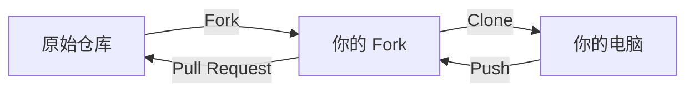

# 第六章：GitHub——协作、Pull Request 与更多

## 本章你会学到什么

- 理解 Git 和 GitHub 的区别，以及 GitHub 在 Git 之上添加了什么
- 浏览 GitHub 界面：仓库、文件、提交和历史
- 用 Issues 追踪任务、bug 和想法
- 创建和审查 Pull Request（PR）
- Fork 仓库并为你没有权限的项目做贡献
- 用 GitHub Actions 做基础自动化

## Git 不是 GitHub

你已经用了五章的 Git——提交、分支、合并、推送、拉取。这些全部通过 Git 完成，它是版本控制系统。但当你推送到 `github.com` 时，你用的是 GitHub，这是另一回事。

Git 是引擎。它追踪修改、管理分支、处理合并。它运行在你的电脑上，也可以运行在任何服务器上。

GitHub 是建立在 Git 之上的平台。它提供了 Git 本身不具备的东西：

- 一个查看代码和历史记录的网页界面
- 协作工具：Issues、Pull Request、代码审查
- 社交功能：个人资料、关注者、星标、Fork
- 自动化：GitHub Actions，用于 CI/CD
- 托管服务：静态网站、包注册表、项目主页

可以这样理解：Git 是版本控制技术。GitHub 是让版本控制对团队和社区变得可用的网站。其他平台如 GitLab 和 Bitbucket 做着同样的事——它们是基于同一个 Git 基础构建的不同网站。

本章聚焦 GitHub，因为它使用最广泛。但 Pull Request、代码审查、Issue 追踪这些概念，在所有 Git 托管平台上都有类似的形式。

## 初识 GitHub

### 仓库页面

当你访问 GitHub 上的一个仓库（比如 `github.com/yourname/your-repo`），你会看到几个关键区域：

- **Code 标签页**：默认视图。显示文件树、README 预览，以及克隆、Fork、下载的快捷按钮
- **Commits 链接**：显示提交历史，包含提交信息、作者和时间
- **分支选择器**：左上角的下拉菜单，用于切换分支
- **绿色的 "Code" 按钮**：提供克隆 URL（HTTPS 和 SSH），以及用 GitHub Desktop 或 VS Code 打开的选项

### 浏览代码和历史

点击任何文件可以查看其内容。在文件视图的顶部，你会看到：

- 最后修改这个文件的提交
- "History" 按钮，显示所有修改过这个文件的提交
- "Blame" 按钮，显示每一行是谁在什么时候改的（追踪 bug 引入者的利器）

### 在 GitHub 上比较版本

你可以在浏览器中直接比较任意两个分支或提交，导航到：

```
github.com/yourname/your-repo/compare/branch-a...branch-b
```

GitHub 会逐文件显示完整的 diff，和 `git diff` 一样的绿色/红色标记。这在创建 Pull Request 之前特别有用——你可以预览你提议的改动具体是什么。

## Issues：组织工作

Issue 是 GitHub 追踪任务、bug、功能请求和想法的方式。每个仓库都有一个 Issues 标签页。

### 创建 Issue

点击 "Issues" → "New Issue"。填写以下内容：

- **标题**：对问题或任务的简短、具体的描述
- **描述**：关于需要做什么、如何复现 bug、或功能请求背景的详细信息
- **标签**：如 `bug`、`enhancement`、`documentation`、`help wanted`（可自定义）
- **负责人**：谁负责处理这个 Issue
- **项目**：可选——用于把 Issue 归入更大的计划

### 写好一个 Issue

一个好的 Issue 足够具体，让别人（或未来的自己）接手时知道该做什么。以下是一个实用的模板：

```markdown
## 问题
第三章第二节用了错误的变量名。
当前显示 `v = s/t`，应该是 `v = Δs/Δt`。

## 期望行为
公式应该正确表示平均速度。

## 位置
文件：`docs/chapters/03-viewing-history-diff-and-undo.md`
章节："比较差异"

## 建议修复
将 `v = s/t` 替换为 `v = Δs/Δt`，并简要解释为什么 delta 符号很重要。
```

### 用提交自动关闭 Issue

你可以在提交信息或 Pull Request 描述中包含 Issue 编号加关键字，让 GitHub 在合并时自动关闭对应的 Issue：

```bash
$ git commit -m "fix: correct velocity formula (closes #12)"
```

可用的关键字：`close`、`closes`、`closed`、`fix`、`fixes`、`fixed`、`resolve`、`resolves`、`resolved`。GitHub 会从提交信息和 PR 描述中读取这些关键字，自动关闭被引用的 Issue。

## Pull Request：提议和审查修改

Pull Request（PR）是 GitHub 上核心的协作机制。它是一个把一个分支的改动合并到另一个分支的提议，内置了讨论和审查流程。

### 创建 Pull Request

工作流程：

```bash
# 1. 为你的工作创建分支
$ git switch -c fix/velocity-formula

# 2. 做你的修改
# （编辑文件）

# 3. 提交并推送
$ git add chapters/03-viewing-history-diff-and-undo.md
$ git commit -m "fix: correct velocity formula (closes #12)"
$ git push -u origin fix/velocity-formula

# 4. 去 GitHub，你会看到一个绿色横幅：
#    "fix/velocity-formula had recent pushes"
#    点击 "Compare & pull request"
```

在 PR 创建页面，你需要填写：

- **标题**：PR 做了什么的简要总结
- **描述**：改动的详细说明、动机，以及相关的 Issue 编号
- **审查者**：你希望谁来审查你的代码（团队协作时）
- **标签**：用于分类的标签

### 审查 Pull Request

当有人创建 PR 后，审查者可以：

- **评论**：留下一般性的反馈或问题
- **批准**：表示改动看起来没问题
- **请求修改**：要求在合并前做具体的调整

评论可以针对整个 PR，也可以针对代码的特定行。行级评论特别适合精确指出需要修改的地方。

### 合并 Pull Request

审查完成后，PR 可以被合并。GitHub 提供三种合并策略：

| 策略 | 结果 | 什么时候用 |
|------|------|-----------|
| **Merge commit** | 创建一个新提交来合并两条分支 | 想保留完整的分支历史时 |
| **Squash and merge** | 把所有提交压缩成一个 | 分支上有许多零碎提交，应该合成一个干净的条目时 |
| **Rebase and merge** | 把每个提交重放到目标分支之上 | 想要干净的线性历史、不要合并提交时 |

对于个人项目中简单的分支，"Squash and merge" 通常是最干净的选择——每个 PR 在 `main` 上变成一个整齐的提交。对于提交历史重要的团队项目，"Merge commit" 保留最多的信息。

### 合并之后

PR 合并后：

- 分支通常会自动删除（可以在设置中更改）
- 关联的 Issue（如果用 `closes #N` 引用了）会自动关闭
- 提交出现在 main 分支的历史中

然后你可以删除本地分支：

```bash
$ git switch main
$ git pull
$ git branch -d fix/velocity-formula
```

## Fork：为你没有权限的项目做贡献

如果你在 GitHub 上发现一个项目，想贡献一个修复或功能，但你没有写入权限怎么办？这就是 Fork 的用途。

### 什么是 Fork？

Fork 是别人仓库的一个个人副本。它存放在你的 GitHub 账号下。你可以在自己的 Fork 里做任何修改——它是你的。当你对修改满意后，你向原始项目发送一个 Pull Request。

### Fork 工作流



具体步骤：

```bash
# 1. 在 GitHub 上，点击原始仓库的 "Fork" 按钮
#    这会在你的账号下创建一个副本

# 2. 克隆你自己的 Fork 到电脑
$ git clone https://github.com/yourname/forked-repo.git
$ cd forked-repo

# 3. 把原始仓库添加为一个远程（叫 "upstream"）
$ git remote add upstream https://github.com/original-owner/repo.git

# 4. 为你的贡献创建分支
$ git switch -c fix/typo-in-readme

# 5. 做修改、提交、推送到你的 Fork
$ git add README.md
$ git commit -m "fix: correct typo in README"
$ git push -u origin fix/typo-in-readme

# 6. 去 GitHub，从你的 Fork 向原始仓库创建 Pull Request

# 7. 让你的 Fork 保持和原始仓库同步
$ git fetch upstream
$ git merge upstream/main
$ git push origin main
```

关键区别：你推送到 `origin`（你的 Fork），然后从你的 Fork 向原始仓库创建 PR。`upstream` 是你拉取更新的来源；`origin` 是你推送工作的目标。

## 让你的 Fork 保持同步

随着时间推移，原始仓库会收到你的 Fork 中没有的更新。要保持最新：

```bash
# 从原始仓库获取最新内容
$ git fetch upstream

# 合并到你本地的 main
$ git switch main
$ git merge upstream/main

# 推送到你的 Fork
$ git push origin main
```

在开始新工作之前先做这一步。如果原始仓库有了很大的变动，在你的 Fork 是最新状态时解决冲突会更容易。

## GitHub Actions：自动化基础

GitHub Actions 是 GitHub 内置的自动化系统。它可以运行测试、构建网站、部署代码等——由推送、Pull Request、定时计划等事件触发。

### Actions 的工作方式

一个 Action 定义为 YAML 文件，存放在仓库的 `.github/workflows/` 目录下。每个工作流指定：

- **触发条件**：什么时候运行（push、PR、定时等）
- **任务**：做什么（运行测试、构建、部署）
- **步骤**：每个任务中的具体命令

### 一个简单示例：推送时自动检查链接

```yaml
name: Check Links
on:
  push:
    branches: [main]
jobs:
  check:
    runs-on: ubuntu-latest
    steps:
      - uses: actions/checkout@v4
      - uses: gaurav-nelson/github-action-markdown-link-check@v1
```

这个工作流在每次推送到 `main` 时运行。它会检查所有 Markdown 文件中的失效链接。如果有链接失效，工作流会失败，你会在提交上看到一个红色的 X。

### 查看工作流结果

推送后，去仓库的 "Actions" 标签页。你会看到工作流运行的列表。点击任意一次运行查看其状态、日志和结果。

Actions 是一个很深的话题——关于 CI/CD 流水线已经出了整本书。目前的关键收获是：GitHub 可以在你每次推送时自动对代码运行检查。这能尽早发现问题，保持项目的可靠性。

## 常见问题与解决

**问题1：我不小心把敏感数据（密码、API 密钥）推到了 GitHub。**

移除数据并强制推送：

```bash
# 从历史中移除文件
$ git filter-branch --force --index-filter \
  "git rm --cached --ignore-unmatch secrets.json" \
  --prune-empty --tag-name-filter cat -- --all

# 强制推送
$ git push --force origin main
```

然后立刻轮换被泄露的凭据。即使从 Git 中移除了，数据可能已被缓存。把任何泄露的密钥视为已泄露。

对于较新的仓库，考虑使用 `git filter-repo` 代替 `git filter-branch`。

**问题2：我的 Pull Request 显示了不是我做的改动。**

这通常意味着你的分支包含了来自 `main` 的你没有打算加入的提交。把你的分支变基到最新的 `main`：

```bash
$ git fetch origin
$ git rebase origin/main
$ git push --force-with-lease origin your-branch
```

**问题3：我无法推送到某个仓库。**

检查你是否有写入权限。如果是别人的仓库，你需要先 Fork，推送到你的 Fork，然后创建 Pull Request。

如果你确实有权限但无法推送，检查你的认证：

```bash
# 测试连接
$ ssh -T git@github.com
# 或检查 HTTPS 凭据
$ git remote -v
```

**问题4：合并后的 PR 在** **`main`** **上看起来不对。**

这可能是因为合并时有冲突，解决得不正确。检查合并提交：

```bash
$ git show <合并提交ID>
```

如果需要，撤销合并：

```bash
$ git revert -m 1 <合并提交ID>
$ git push origin main
```

**问题5：我想为某个项目做贡献，但不知道从哪里开始。**

找标记了 `good first issue` 或 `help wanted` 的 Issue。这些是专门给新贡献者标记的。阅读贡献指南（通常在 `CONTRIBUTING.md` 文件中），在开始工作之前不要犹豫，在 Issue 评论中提问。

## 本章小结

Git 是版本控制引擎；GitHub 是建立在其上的协作平台。GitHub 提供了网页界面、Issues 任务追踪、Pull Request 代码审查、Fork 贡献机制和 Actions 自动化。

Issues 用标题、描述、标签和负责人来组织工作。你可以在提交信息中用 `closes #N` 引用 Issue 来自动关闭它。

Pull Request 是带有内置审查流程的合并提议。三种合并策略——merge commit、squash and merge、rebase and merge——各自产生不同的历史形态。合并后删除功能分支。

Fork 让你能为你没有权限的仓库做贡献。工作流是：Fork → 克隆你的 Fork → 创建分支 → 推送到你的 Fork → 向原始仓库创建 PR。定期从 `upstream` fetch 和 merge 来保持 Fork 同步。

GitHub Actions 通过仓库事件触发自动化工作流。工作流定义为 `.github/workflows/` 目录下的 YAML 文件。

## 下一步

六章下来，你从零 Git 知识走到了能使用分支、远程仓库和 GitHub 协作。最后一章会把所有内容串联成实际的工作流——从个人项目管理到团队协作模式。你会看到所有独立的命令和概念如何组合成真实的开发习惯。
