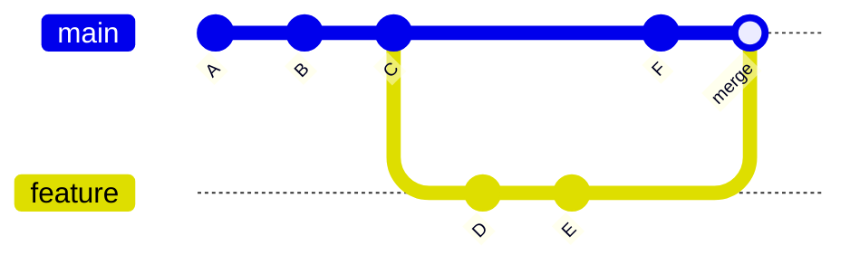
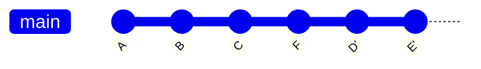
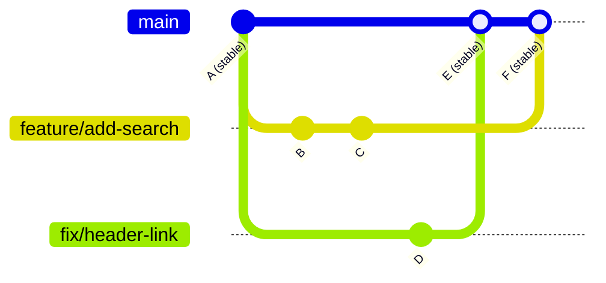

# 第七章：串联一切——真实世界的工作流

## 本章你会学到什么

- 如何把独立的 Git 命令组合成稳定可靠的日常习惯
- 个人项目的工作流：适合独自开发者的模式
- `git rebase` 做什么、什么时候用、为什么要小心
- 团队协作的工作流：分支策略和代码审查
- 用标签和 GitHub Releases 管理版本
- 如何编写 `.gitignore` 文件

## 你已经会了所有动作，现在学编舞

过去六章你学了很多独立的工具：`git init`、`git add`、`git commit`、`git branch`、`git switch`、`git merge`、`git stash`、`git fetch`、`git pull`、`git push`、Issues、Pull Request、Fork。每一个单独看都讲得通。但会单个动作不等于会跳舞。

本章讲的是编舞——如何把这些工具组合成每天可以重复执行的工作流，不用多想就能上手。我们将覆盖三个层次：个人项目的工作流、rebase（之前提到过但还没正式学的工具）、团队协作的工作流。

## 个人项目工作流

当你独自做一个项目时，工作流很简单，但一致性很重要。以下是一个可靠的日常模式。

### 开始工作之前

```bash
# 确保在 main 上，并且是最新的
$ git switch main
$ git pull origin main
```

这保证你的本地 `main` 和远程一致。如果你在另一台机器上做了修改，或者远程通过其他方式被更新了，这一步会把你拉到最新状态。

### 开始一个新任务时

```bash
# 为任务创建分支
$ git switch -c feature/your-task-name
```

即使在个人项目中，为每个任务分支也是值得的。它让你的 `main` 保持干净，让你可以用 `git stash` 在任务间切换，而且不用担心意外把不相关的修改提交在一起。

### 工作过程中

```bash
# 频繁提交，用清晰的消息
$ git add file-you-changed.md
$ git commit -m "add: 第七章引言部分"
```

在自然的停顿点提交——一节写完了、一个 bug 修好了、一个功能可以用了。小而聚焦的提交比大提交更容易理解和撤销。

如果需要中途切换任务：

```bash
$ git stash push -m "第七章引言，写了一半"
$ git switch other-task
# ... 做另一个任务 ...
$ git switch feature/your-task-name
$ git stash pop
```

### 任务完成后

```bash
# 切到 main 并合并
$ git switch main
$ git merge feature/your-task-name

# 推送
$ git push origin main

# 清理
$ git branch -d feature/your-task-name
```

对于个人项目，这通常就够了。不需要 Pull Request——你既是作者又是审查者。保持简单。

### 日常习惯

如果你只养成一个习惯，就养成这个：**永远不要直接在 `main` 上提交。** 即使是很小的修改也要先建分支。当一个快速修复变成了更大的任务，或者你需要突然切换上下文时，这个习惯会无数次救你。

## 理解 Rebase

你在这本书里已经看到 `git rebase` 被提到好几次——合并策略里、强制推送警告里、保持 Fork 同步时。现在该正式理解它到底做什么了。

### Merge 做什么 vs Rebase 做什么

`git merge` 和 `git rebase` 都是把一条分支的改动整合到另一条分支。它们产生的最终结果一样（所有相同的改动都在），但创建的历史不同。

**Merge** 创建一个合并提交——一个有两个父提交的新提交：



历史精确地展示了发生了什么：`main` 收到了提交 F，`feature` 收到了 D 和 E，然后它们被合并了。合并提交保留了时间线。

**Rebase** 把你分支上的提交取下来，重放到另一条分支的顶端：



历史是一条直线。F 在前面，D' 和 E' 重放在它上面。合并提交消失了。最终代码一样，但历史看起来像是所有东西都是按顺序开发的。

### Rebase 命令

```bash
# 把当前分支变基到 main 上
$ git switch feature
$ git rebase main
```

这会把 `feature` 上所有不在 `main` 中的提交（D 和 E）临时保存，把 `feature` 指针移到 `main` 的最新位置（F），然后把 D 和 E 重放上去。产生的提交会获得新的哈希值（D' 和 E'），因为它们技术上是新提交，即使改动内容一样。

### Rebase 的黄金法则

**永远不要对已经推送并与他人共享的提交执行 rebase。**

Rebase 会改写历史——它创建新的提交哈希。如果别人已经拉取了你的原始提交，你 rebase 后再强制推送，他们的本地历史会和改写后的历史冲突。这会造成混乱和仓库损坏。

Rebase 在以下情况是安全的：

- 你在把本地分支变基到更新后的 `main` 上，还没推送
- 你在创建 PR 之前清理自己的本地提交
- 你在自己独有的个人分支上工作

Rebase 在以下情况是危险的：

- 提交已经被推送到共享分支
- 别人在同一条分支上工作
- 提交已经被包含在别人已经审查过的 Pull Request 中

### 交互式 Rebase

`git rebase -i`（交互式 rebase）让你修改最近的提交——重新排序、合并、编辑消息或删除。它是 Git 中保持历史整洁最强大的工具之一。

```bash
# 交互式变基最近 3 个提交
$ git rebase -i HEAD~3
```

这会打开你的编辑器，列出最近 3 个提交：

```
pick d4a5e6f add: 引言部分
pick f7b8c1d add: 个人项目工作流
pick a2e3f4b fix: rebase 解释中的错别字
```

你可以把 `pick` 改成其他命令：

- `reword` — 保留提交但修改消息
- `squash` — 把这个提交合并到前一个提交中
- `drop` — 完全删除这个提交
- 重新排列行顺序 — 改变提交顺序

例如，如果那个错别字修复很琐碎，不应该单独作为一个提交：

```
pick d4a5e6f add: 引言部分
pick f7b8c1d add: 个人项目工作流
fixup a2e3f4b fix: rebase 解释中的错别字
```

`fixup` 和 `squash` 类似，但会丢弃提交消息。保存退出后，错别字修复被合并到前一个提交中。你的历史更干净了。

## 团队协作工作流

当多个人在同一个仓库上工作时，需要更多结构。以下是一个适合中小团队的高效方法。

### 分支策略

一个简单有效的策略：

- `main` — 始终稳定，始终可部署。只通过 PR 合并进去，永远不直接提交。
- `feature/*` — 新功能或新内容。每个任务一条分支。从 `main` 创建，通过 PR 合并回去。
- `fix/*` — bug 修复。规则和 feature 分支一样。
- `experiment/*` — 有风险或探索性的工作。可以随时放弃，没有后果。



核心原则：`main` 只通过合并往前走，永远不通过直接提交。这意味着 `main` 始终处于已知的好状态。

### PR 工作流

在团队中工作时，每个改动都通过 Pull Request：

```bash
# 1. 从最新的 main 开始
$ git switch main
$ git pull origin main

# 2. 创建功能分支
$ git switch -c feature/add-search

# 3. 工作和提交
# （做修改、add、commit，用清晰的消息）

# 4. 推送并创建 PR
$ git push -u origin feature/add-search
# 然后在 GitHub 上创建 PR

# 5. 处理审查反馈
# （如果需要，做更多提交，再次推送）

# 6. PR 合并后，清理本地
$ git switch main
$ git pull origin main
$ git branch -d feature/add-search
```

### 代码审查习惯

好的代码审查是一种技能。几个原则：

- **审查代码，不审查人。** 关注改动本身，不是谁写的。
- **要具体。** "这看起来不对"不如"这个变量名有误导性，因为它实际上存的是计数而不是总数。"
- **区分阻塞性和非阻塞性评论。** 阻塞性评论意味着"合并前必须修这个"。非阻塞性评论是建议或问题。
- **及时审查。** 一个 PR 放了好几天没人审查会拖慢整个团队。
- **保持 PR 小。** 改了 50 行的 PR 比改了 500 行的容易审查得多。如果你的 PR 很大，考虑拆分。

## 标签和发布

当你的项目到达一个有意义的里程碑——一个你想标记的版本、一个你想分享的发布——标签和 GitHub Releases 就是该用的工具。

### Git 标签

标签是对某个提交的永久标记。和分支指针不同，标签不会移动。它们固定在创建时指向的提交上。

```bash
# 创建轻量标签
$ git tag v1.0.0

# 创建附注标签（推荐——包含消息和作者）
$ git tag -a v1.0.0 -m "第一个稳定版：所有核心章节完成"

# 推送标签到远程
$ git push origin v1.0.0

# 推送所有标签
$ git push origin --tags

# 列出标签
$ git tag

# 查看标签详情
$ git show v1.0.0
```

用附注标签（`-a`）代替轻量标签。附注标签存储打标签人的名字、邮箱、日期和消息——这些都是发布的重要元数据。轻量标签只是一个指向提交的名字，没有额外信息。

### GitHub Releases

GitHub Release 建立在 Git 标签之上，额外提供：

- 人可读的变更描述
- 二进制附件（编译产物、压缩包等）
- 一个用户可以访问的专属页面

创建 Release 的步骤：

1. 去 GitHub 上的仓库
2. 点击 "Releases" → "Draft a new release"
3. 选择或创建标签（如 `v1.0.0`）
4. 写标题和描述
5. 可选：附上文件
6. 点击 "Publish release"

你也可以用 GitHub CLI（`gh`）从命令行创建：

```bash
# 创建一个 release
$ gh release create v1.0.0 --title "v1.0.0" --notes "第一个稳定版本"
```

### 版本号：语义化版本

语义化版本（SemVer）是一种给版本编号的约定：

```
MAJOR.MINOR.PATCH
  1   . 0  . 0
```

- **MAJOR**：不兼容的破坏性变更（API 改了、功能移除了）
- **MINOR**：向后兼容的新功能
- **PATCH**：向后兼容的 bug 修复

举例：

- `1.0.0` → `2.0.0`：整个 API 重写了，旧代码不能用了
- `1.0.0` → `1.1.0`：加了一个搜索功能，现有代码不受影响
- `1.0.0` → `1.0.1`：修复了页面加载时的崩溃

对于文档项目如教材，你可以简化：

- `1.0.0`：第一个完整版（所有章节写完）
- `1.1.0`：新增章节或重大修订
- `1.1.1`：修复错别字或错误

## `.gitignore` 文件

不是所有文件都应该放进 Git。构建产物、系统文件、密钥和临时文件应该被排除。`.gitignore` 告诉 Git 忽略哪些文件。

### 常见条目

```gitignore
# 系统文件
.DS_Store
Thumbs.db

# 编辑器文件
.vscode/
.idea/
*.swp

# 依赖
node_modules/

# 构建输出
dist/
build/

# 环境变量和密钥
.env
.env.local
secrets.json
```

### `.gitignore` 的规则

- 每行一个模式
- `#` 开头是注释
- `*.log` 忽略所有以 `.log` 结尾的文件
- `build/` 忽略整个 `build` 目录
- `!important.log` 取反——即使其他 `.log` 文件被忽略，也要跟踪这个
- 模式相对于 `.gitignore` 文件所在的位置

### 如果文件已经被跟踪了，但本应该忽略

把文件加到 `.gitignore` 不会停止对已提交文件的跟踪。你需要从 Git 的跟踪中移除它：

```bash
# 从跟踪中移除（保留磁盘上的文件）
$ git rm --cached file.log

# 从跟踪中移除整个目录
$ git rm -r --cached dist/

# 提交这个改动
$ git commit -m "chore: stop tracking dist/ directory"
```

GitHub 在 `github.com/github/gitignore` 提供了各种语言和框架的现成 `.gitignore` 模板。

## 常见问题与解决

**问题1：我一直在** **`main`** **上提交，现在应该用分支。**

从当前状态创建分支，然后把 `main` 往回退：

```bash
$ git branch my-work          # 把当前状态保存为分支
$ git reset --hard HEAD~3     # 把 main 往回退 3 个提交（调整数字）
```

现在 `my-work` 有你的提交，`main` 是干净的。

**问题2：Rebase 搞砸了，一切都很乱。**

你总是可以撤销 rebase：

```bash
$ git reflog
# 找到 rebase 之前的提交（找 "HEAD@{N}"）
$ git reset --hard HEAD@{N}
```

Reflog 记录了 90 天内每次 HEAD 的移动。即使 rebase 搞砸了，你的原始提交仍然可以恢复。

**问题3：我不小心推到了错误的分支。**

把提交移到正确的分支：

```bash
$ git branch correct-branch         # 保存提交
$ git reset --hard HEAD~1           # 从当前分支移除
$ git push --force-with-lease origin current-branch  # 修复远程
$ git switch correct-branch
$ git push -u origin correct-branch
```

**问题4：团队成员的 PR 和我最近的修改冲突了。**

和团队成员协调。让他们把分支变基到最新的 `main`：

```bash
$ git switch main
$ git pull origin main
$ git switch their-branch
$ git rebase main
$ git push --force-with-lease origin their-branch
```

这是安全的，因为 `--force-with-lease` 确保期间没有人往那条分支上推送。

**问题5：我想看两个版本之间改了什么。**

用 `git log` 配合标签名：

```bash
# 两个标签之间的改动
$ git log v1.0.0..v1.1.0 --oneline

# 详细的改动
$ git log v1.0.0..v1.1.0 --stat
```

这在写发布说明时特别有用。

## 本章小结

工作流是把独立的 Git 命令组合成可重复流程的方式。个人项目：为每个任务分支，频繁提交，合并到 `main`，推送，清理。核心习惯是永远不要直接在 `main` 上提交。

`git rebase` 把提交重放到另一条分支的顶端，创建线性历史而不是合并提交。它对本地未共享的提交是安全的。黄金法则：永远不要对别人已经拉取的提交执行 rebase。交互式 rebase（`git rebase -i`）让你编辑、合并、重排或删除最近的提交。

团队协作需要结构：`main` 保持稳定，只接收合并；每个改动都通过 PR；代码审查要及时具体；PR 要小而聚焦。

标签永久标记重要提交。发布时用附注标签（`git tag -a`）。GitHub Release 在标签基础上添加描述和附件。语义化版本（`MAJOR.MINOR.PATCH`）提供一致的版本号规范。

`.gitignore` 排除不该被跟踪的文件——系统文件、构建产物、密钥和临时文件。用 `git rm --cached` 停止跟踪已经提交的文件。

## 接下来去哪里

七章之前，你可能在想版本控制到底值不值得费这个劲。现在你看到了答案：它不只是备份文件。它是让你能自信地工作——知道你可以撤销错误、安全地做实验、协作时不会互相踩脚、可以回头看项目历史中的任何一点。

你学到的命令是工具。本章的工作流是习惯。真正的技能来自练习——每天用 Git，直到命令变成肌肉记忆，工作流变成第二本能。

你不需要记住所有东西。把这本书放在手边当参考。忘了一个选项或工作流步骤时，查一下。用不了多久，你会越来越少需要它。

祝你好运，happy committing。
